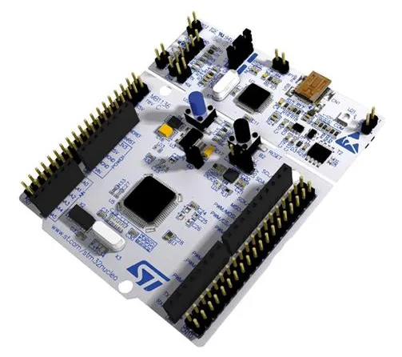

# Nucleo-F411RE

Nucleo 系列开发板是 ST 公司为推广 STM32 微控制器而设计的，它也是 ST 官方最便宜的开发板。Nucleo 开发板上带有 ST-Link/V2 仿真器，可以直接下载和仿真。Nucleo-F411RE 是 Nucelo 系列开发板中高性能的型号，使用了 STM32F411RE 控制器，可以很好的支持 MicroPython。

在 Nucleo 系列开发板中，除了使用 STM32F2/STM32F3 单片机的系列外，其它系列中 只要Flash 容量大于 256K、RAM 大 于 16K 的型号，很多也可以运行micropython。
