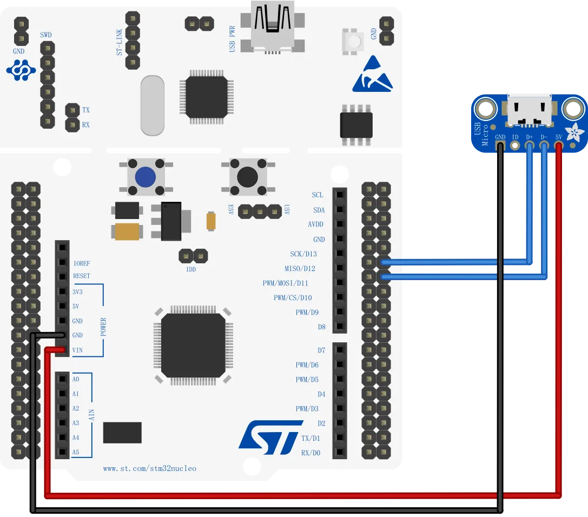

# Nucleo-64 开发板连接原生 USB 接口

Nucleo-64 系列开发板的 USB 是一个 ST-Link 仿真器带有的，并不是连接主芯片的，因此也就无法使用 USBVCP、USB存储等功能。但实际上Nucleo-64 开发板已经将主芯片的 USB 引脚（PA11/DM/D-、PA12/DP/D+）引出，只是没有预留 USB 插座。因此，只要将PA11、PA12连接到USB插座，就能使用 USB 功能。

具体连接方式参考下图，USB插座的 VBUS 连接到 Nucleo 的 Vin，并将供电方式改为外部供电，这样就可以通过 USB 提供电源。

