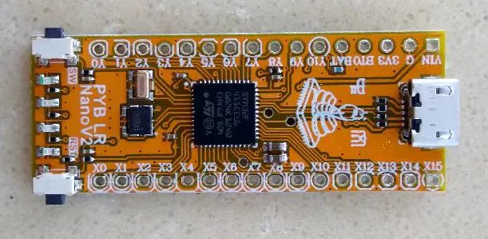

# PYB Nano

PYB Nano 是 MicroPython 中文社区为推广 MicrPython 而专门设计的低成本 PyBoard，它的体积小巧（和 Arduino Nano/ST Nucleo 32 大小相仿），GPIO 全部引出，功能上兼容官方的 pyboard，支持 RTC 和加速度传感器，以及通过 USB 升级固件。此外还增加了8MB 大容量存储器，可以保存更多程序和文件。PYB Nano 也是完全开源的，相关设计文件已经在 github 上进行共享。

- https://github.com/micropython-Chinese-Community/pyboardCN 
- [micropython 固件](https://gitee.com/microbit/MicroPython_firmware/tree/master/PYBNanoV2)
- [circuitpython 固件](https://circuitpython.org/board/pyb_nano_v2/)
