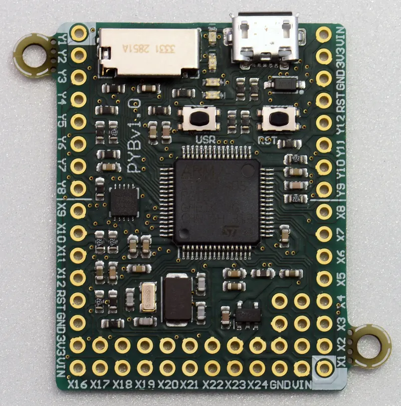

# pyboard

pyboard 是官方专为 micropython 设计的第一个开发板，也是 micropython 众筹时的开发板。它使用了 STM32F405RG 微控制器，带有3轴加速度传感器和TF卡接口。最早的 pyboard 是 pybv10，后来又逐渐衍生出pybv10lite、pybv11、pybv3、pybv4等版本，它们之间的区别很小，主要在于布局、元件参数、传感器等。

pyboard 的完整设计文件存放在 github 上，使用 eagle 设计。

**相关链接**
- https://github.com/micropython/pyboard
