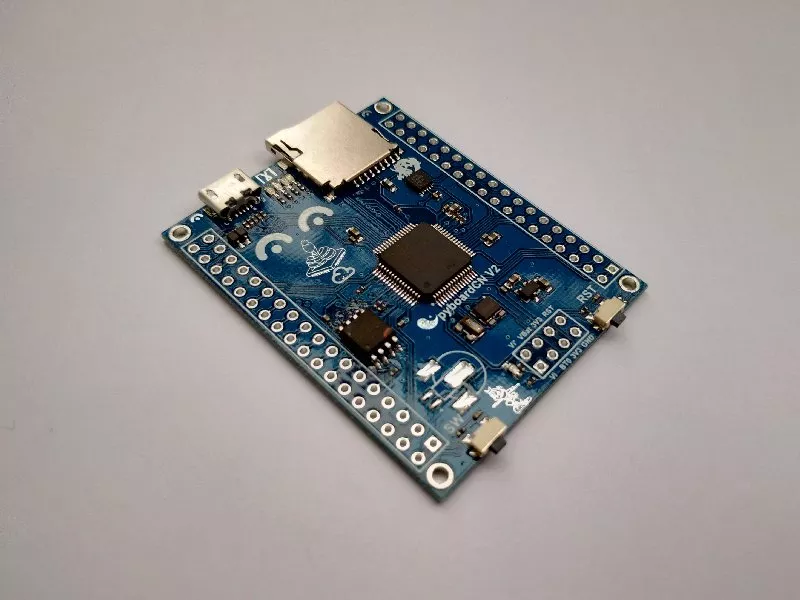

# pyboardCN

pyboardCN 是 MicroPython 中文社区为学习和研究 MicroPython 而设计，它在功能上完全兼容官方的 pybv10，并增加了 8 MB 的 flash，可以保存更多数据和文件。可以直接运行官方 pybv10 的固件。它可以作为 micropython 学习板，也可以作为 STM32 学习板使用。

pyboardCN 也是一个开源项目，包括了完整的原理图、PCB、固件文件。它的网址是：
https://gitee.com/microbit/pyboardCN