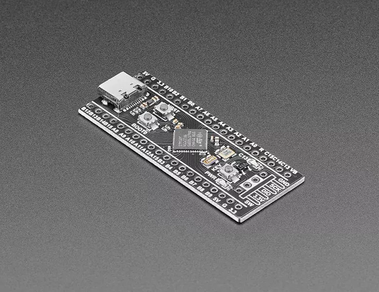

# STM32F411CE Black Pill

## 特性

* STM32F411CEU6处理器，主频 100 MHz，RAM 128 KB，flash 512 KB
* 25MHz 高速晶体振荡器，以及 32.768kHz、负载电容 6PF 的低速晶体振荡器
* 采用沉金工艺与无铅工艺，引脚排列处进行镀金处理，环保性更强
* 预留 Flash 焊盘，提供 USBDisk 及 FATFFS（文件系统）例程
* 支持 MicroPython 编程，提供可用的 MicroPython 固件
* 支持 Arduino 编程开发
* 支持 C 语言编程开发
* 3 个按键，分别为复位键（reset key）、BOOT0 键和用户自定义键（user key）
* 提供 CMSIS-DAP 固件

## 相关链接

- [开发板资料](https://github.com/WeActStudio/WeActStudio.MiniSTM32F4x1)
- [micropython 固件](https://micropython.org/download/WEACT_F411_BLACKPILL/)
- circuitpython 固件
  - [不带 flash 芯片](https://circuitpython.org/board/stm32f411ce_blackpill/)
  - [带有 flash 芯片](https://circuitpython.org/board/stm32f411ce_blackpill_with_flash/)
