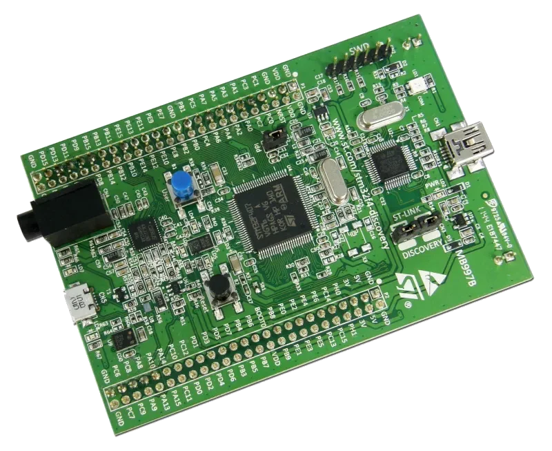

# STM32F4 DISCOVERY

STM32F4DISCOVERY探索套件，是STM32 最早的 Discovery 开发板之一。它充分利用STM32F407高性能微控制器的功能，支持用户轻松开发音频应用。其中包含1个ST-LINK/V2-A嵌入式调试工具、1个ST-MEMS数字加速度计、1个数字麦克风、1个带有集成式D类扬声器驱动器的音频DAC、LED、按钮以及1个USB OTG Micro-AB连接器。

- STM32F407VGT6微控制器，配有32位Arm® Cortex®-M4+FPU内核、1 MB Flash存储器和192 KB RAM，采用LQFP100封装
- USB OTG FS
- ST MEMS 3轴加速度计
- ST-MEMS音频传感器全向数字麦克风
- 带有集成式D类扬声器驱动器的音频DAC
- 用户按钮和复位按钮
- 8个LED：
  - 用于指示USB通信的LD1（红/绿）
  - 用于指示3.3 V电源开启的LD2（红色）
  - 4个用户LED：LD3（橙色）、LD4（绿色）、LD5（红色）和LD6（蓝色）
  - 2个USB OTG LED：VBUS LD7（绿色）和过流LD8（红色）
- 开发板连接器：
  - 带Micro-AB的USB
  - 立体声耳机输出插孔
  - 适用于各种LQFP100 I/O的2.54 mm间距扩展插针，便于快速连接原型板并轻松进行测试
- 灵活的供电选项：ST-LINK、USB VBUS或外部电源 
		
## 相关链接

- [开发板网站](https://www.st.com.cn/zh/evaluation-tools/stm32f4discovery.html)
- [micropython 固件](https://micropython.org/download/STM32F4DISC/)
- [circuitpython 固件](https://circuitpython.org/board/stm32f4_discovery/)
