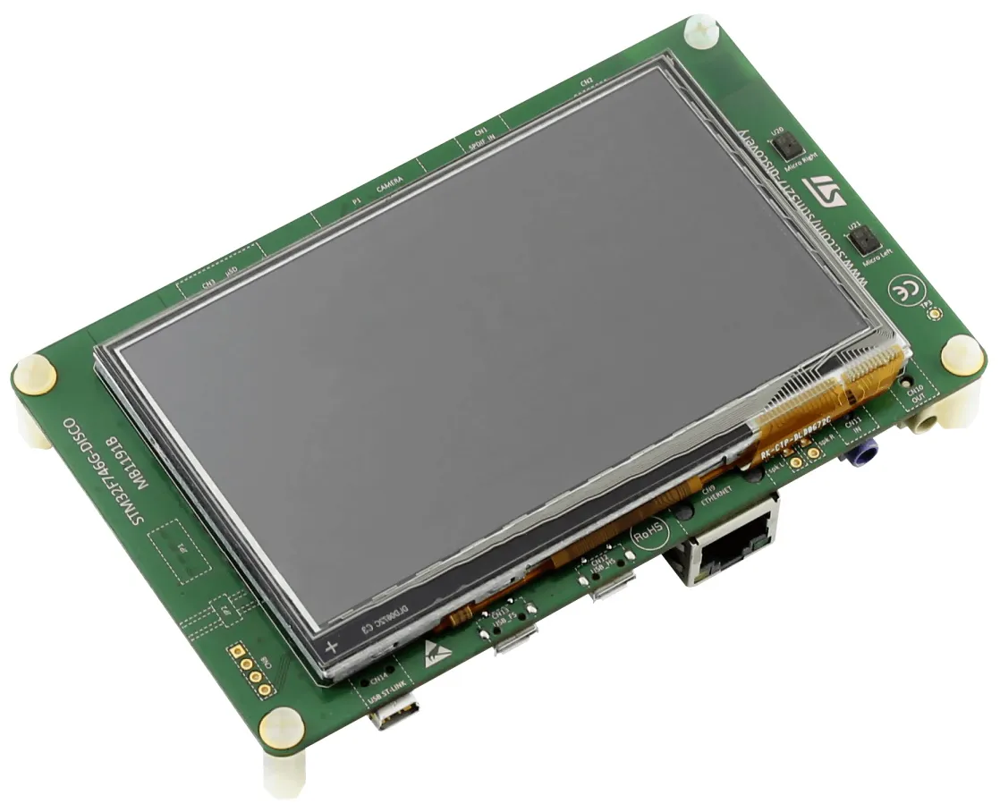

# STM32F746G DISCOVERY

ST官方最早的STM32F7开发板之一，带有一个 4.3寸分辨率 480×272 的 TFT 触摸屏。

## 相关链接

- [开发板网站](https://www.st.com/content/st_com/en/products/evaluation-tools/product-evaluation-tools/mcu-mpu-eval-tools/stm32-mcu-mpu-eval-tools/stm32-discovery-kits/32f746gdiscovery.html)
- [micropython 固件](https://micropython.org/download/STM32F7DISC/)
	- [STM32F746G Disco 上的 MicroPython](https://www.galliumio.com/1819/micropython-on-stm32f746g-disco/)
	- [LVGL 在 STM32F746 Discovery 上的 Micropython 绑定](https://blog.lvgl.io/2020-08-10/stm32-microptyothon-and-lvgl)
	- [带有 LCD 驱动的早期版本](https://github.com/Dahsheg/microPython)
- [circuitpython 固件](https://circuitpython.org/board/stm32f746g_discovery/)
