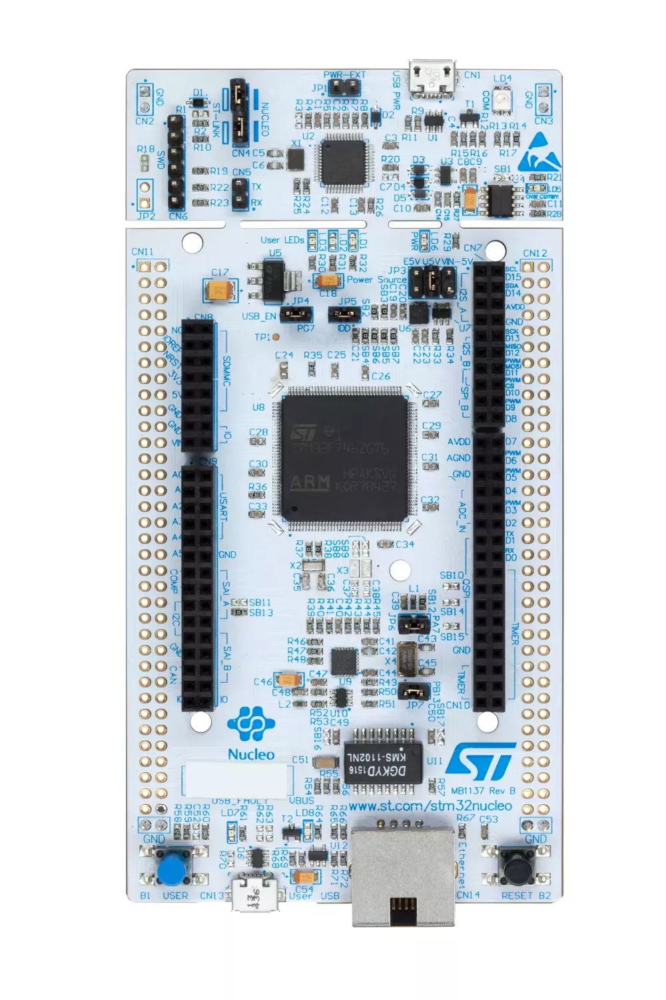

# STM32F746ZG Nucleo-144

STM32 Nucleo-144 系列开发板中的 STM32F746ZG，使用了高性能的 STM32F7 系列处理器，板载 ST-LINK 调试器。

## 相关链接

- [开发板网站](https://www.st.com/content/st_com/en/products/evaluation-tools/product-evaluation-tools/mcu-mpu-eval-tools/stm32-mcu-mpu-eval-tools/stm32-nucleo-boards/nucleo-f746zg.html)
- [micropython 固件](https://micropython.org/download/NUCLEO_F746ZG/)
- [circuitpython 固件](https://circuitpython.org/board/nucleo_f746zg/)
