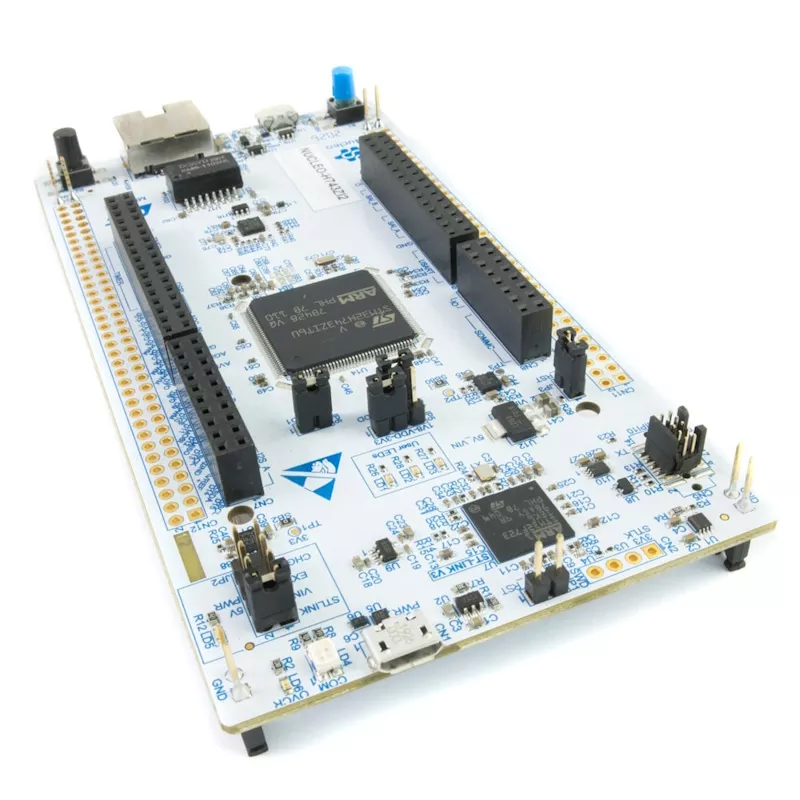

# STM32H743ZI Nucleo-144

STM32 Nucleo-144 系列开发板中的 STM32H743，使用了更高性能的 STM32H7 系列处理器，板载 ST-LINK 调试器。

## 相关链接

- [开发板网站](https://www.st.com/en/evaluation-tools/nucleo-h743zi.html)
- micropython 固件
	- [STM32H743ZI](https://micropython.org/download/NUCLEO_H743ZI/)
	- [STM32H743ZI2](https://micropython.org/download/NUCLEO_H743ZI2/)
- [circuitpython 固件](https://circuitpython.org/board/nucleo_h743zi_2/)
