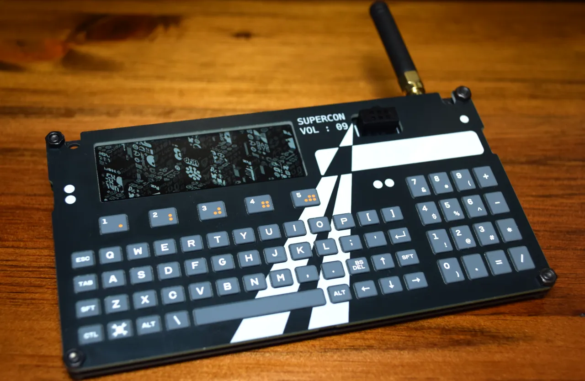
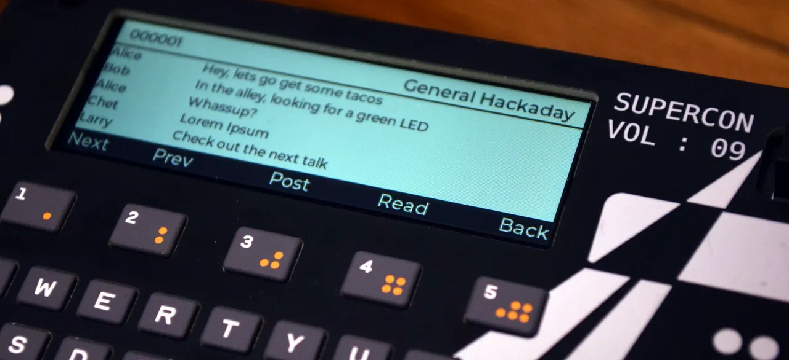

# 2025 年 HACKADAY 超级会议传播者徽章

在 2025 年 10 月 31 日至 11 月 2 日举行的 Hackaday 超级会议的徽章是一款相当强大的设备，配备 ESP32-S3，配备 8 MB PSRAM 和 16 MB 闪存、LCD 屏幕、SX1262 LoRa 模块、LiPo 电池/充电和 Solder Party 定制键盘，并使用定制版本的 lvgl_micropython。

## 相关链接
- [Hackday](https://hackaday.com/2025/10/23/announcing-the-2025-hackaday-superconference-communicator-badge/)
- [github](https://github.com/Hack-a-Day/2025-Communicator_Badge)
