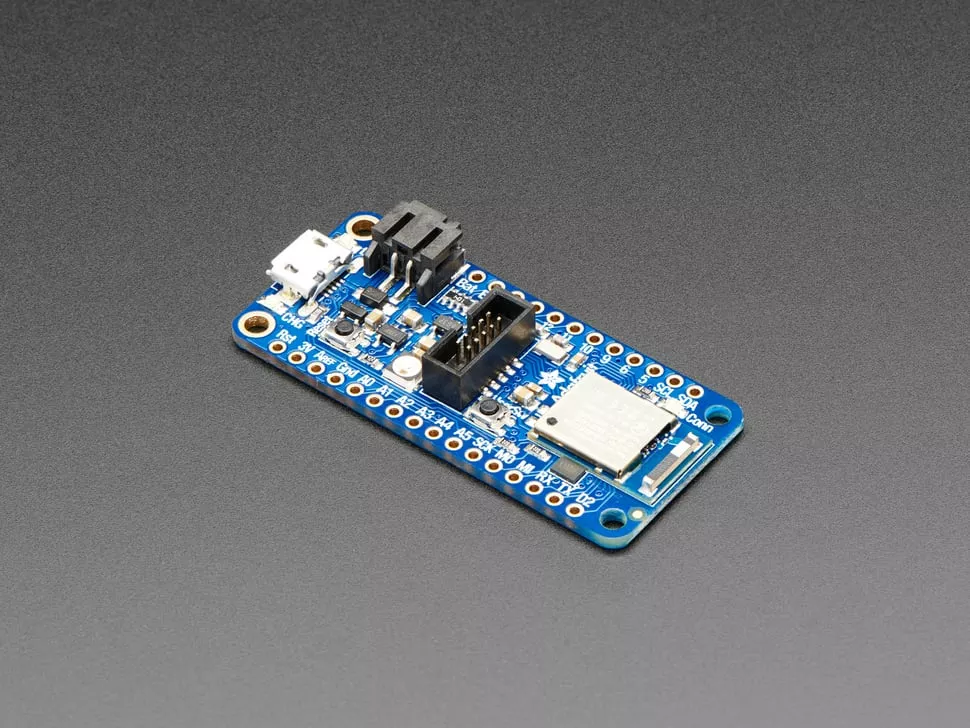
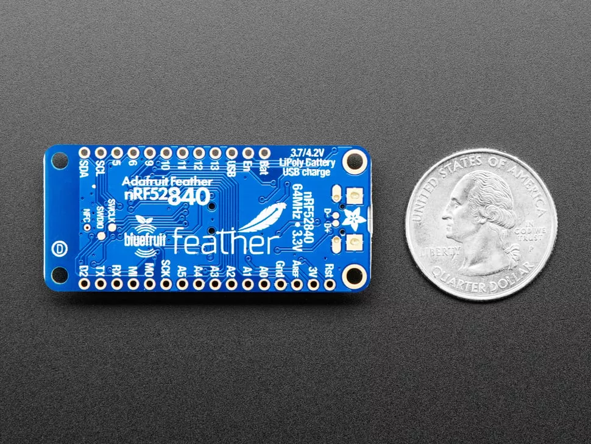

# Feather nRF52840 Express

Adafruit 羽毛系列开发板中的 Feather nRF52840 Express，使用了 Nordic 的高性能 nRF52840 Cortex-M4 处理器，支持蓝牙 BLE 以及原生 USB ，这意味着可以将其用作 UART（CDC）、HID（键盘鼠标）、Mass Storage、MIDI 等！

## 主要特点

* 搭载 ARM Cortex M4F 内核（具备硬件浮点加速功能），运行频率为 64MHz
* 1MB 闪存（flash）及 256KB 静态随机存取存储器（SRAM）
* 原生开源 USB 协议栈 
* 兼容低功耗蓝牙（Bluetooth Low Energy）的 2.4GHz 无线射频
* 已通过 FCC（美国联邦通信委员会）、IC（加拿大工业部）、TELEC（日本无线设备技术标准合格认证）认证的模块
* 最高 + 8dBm 输出功率
* 工作电压范围 1.7V 至 3.3V，内置线性稳压器和 DC/DC（直流 - 直流）稳压器
* 21 个通用输入输出引脚（GPIO）、6 个 12 位模数转换引脚（ADC）、最多 12 路脉冲宽度调制输出（3 个 PWM 模块，每个模块含 4 路输出）
* 板载红色 LED 和 WS2812
* 电源 / 使能引脚
* 未焊接排针时的尺寸：2.0 英寸 ×0.9 英寸 ×0.28 英寸（换算为公制：51 毫米 ×23 毫米 ×7.2 毫米）
* 重量仅 6 克（约相当于一根 “大号” 羽毛的重量）
* 4 个安装孔
* 复位按钮
* 用于调试的 SWD（串行线调试）接口
* 兼容 Adafruit FeatherWing 扩展板

## 相关链接

* [micropython 固件下载](https://micropython.org/download/FEATHER52/)
* [circuitpython 固件下载](https://circuitpython.org/board/feather_nrf52840_express/)
* [Adafruit 官方商城](https://www.adafruit.com/product/4062)
* [Adafruit nRF52840 Feather 开发板介绍](https://learn.adafruit.com/introducing-the-adafruit-nrf52840-feather)

## 其它

* 在使用 circuitpython 时，需要先安装 [UF2 Bottloader](https://github.com/adafruit/Adafruit_nRF52_Bootloader/)，然后才能写入 uf2 格式固件。
