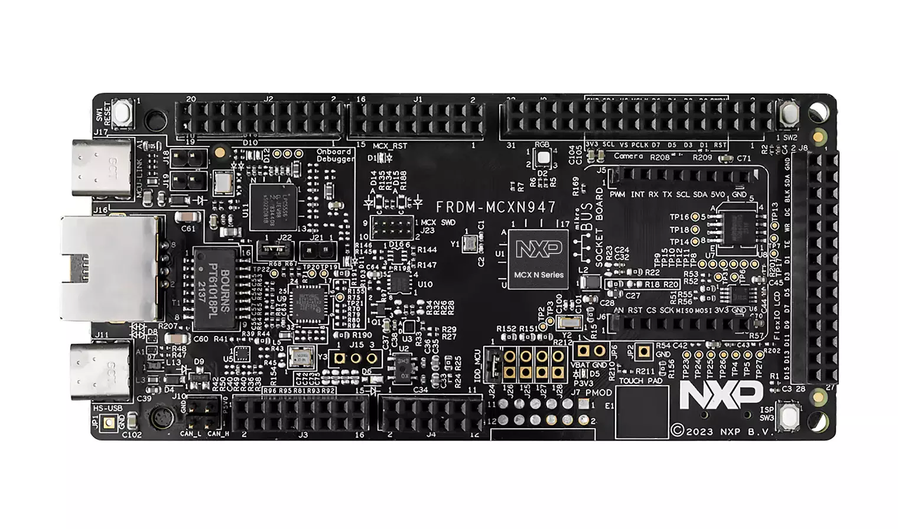

# FRDM-MCXN947

FRDM-MCXN947是一款紧凑且可扩展的开发板，可让您快速基于MCX N94和N54 MCU开展原型设计。它们提供行业标准的接口，可轻松访问MCU的I/O、集成的开放标准串行接口、外部闪存和板载MCU-Link调试器。

## 相关链接

- [开发板网址](https://www.nxp.com.cn/design/design-center/development-boards-and-designs/FRDM-MCXN947)
	- [芯片手册](https://www.nxp.com.cn/docs/en/data-sheet/MCXNP184M150F70.pdf)
	- [开发板用户手册](https://nxp-docs-be-prod.nxp.com/bundle/UM12018/preprocessedpdf/enus)
	- [开发板在线手册](https://docs.nxp.com/bundle/UM12018/page/topics/Evk_overview.html)
- [circuitpyrhon 固件](https://circuitpython.org/board/nxp_frdm_mcxn947/)
