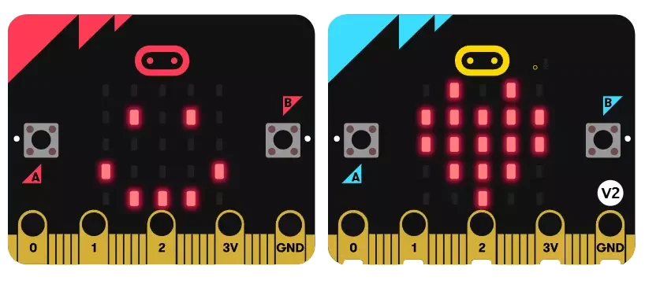

# micro:bit

micro:bit 是英国为青少年编程教育设计的微型计算机（开源硬件），旨在通过编程和电子技术激发学生的创造力和学习兴趣。

micro:bit 的尺寸小巧（长5cm×宽4cm），集成了多种传感器，包含5x5 LED点阵屏、两个可编程按钮、加速度计、电子罗盘、温度传感器、蓝牙无线通信模块等，支持多种编程语言和图形化编程工具，如MakeCode、Python和JavaScript。

目前 micro:bit  的硬件有两个版本：V1/V2，V2版本的 MCU 性能更强，硬件资源更加丰富。

注：
- microbit 的 micropython 有两个不同版本（这两个版本都是 micropython 官方开发的）：一个是 micro:bit 基金会定制版本，删除了部分底层模块，加入一些micro:bit专用驱动，使用起来更加简单有趣；另一个是通用版本，功能和其它开发板一致。

**相关链接**：

- [官方网站](https://microbit.org/)
- [micro:bit MicroPython 文档](https://microbit-micropython.readthedocs.io/en/v2-docs/)
- [Python Editor 在线编程](https://python.microbit.org/)
- [micro:bit v1  micropython 固件](https://micropython.org/download/MICROBIT/)
- [micro:bit v2 circuitpython 固件](https://circuitpython.org/board/microbit_v2/)
