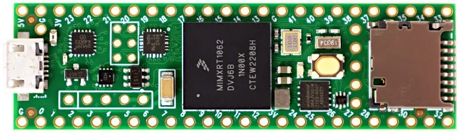
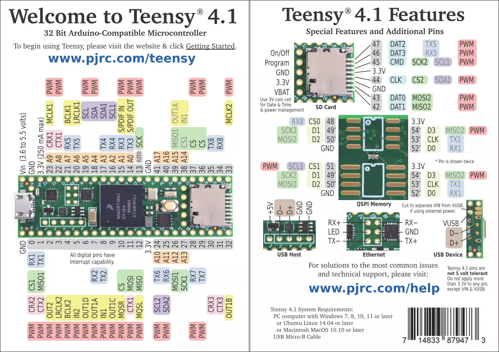

# Teensy 4.1

## 规格

* ARM Cortex-M7 频率为 600 MHz
* 64 位和 32 位浮点数学单元
* 7936K 闪存、1024K RAM（512K 紧密耦合）、4K EEPROM（仿真）
* QSPI 内存扩展，2 个额外 RAM 或闪存芯片的位置
* USB 设备 480 Mbit/s，USB 主机 480 Mbit/s
* 55 个数字输入/输出引脚，35个 PWM 输出引脚
* 18 个模拟输入引脚
* 8 个串行端口、3 个 SPI、3 个 I2C 端口
* 2 个 I2S/TDM 和 1 个 S/PDIF 数字音频端口
* 3 个 CAN 总线（1 个带 CAN FD）
* 1 个 SDIO（4 位）原生 SD 卡端口
* 以太网 10/100 Mbit，带 DP83825 PHY
* 32 个通用 DMA 通道
* 快速加密和随机数生成器
* RTC
* 可编程 FlexIO
* 像素处理管线
* 外设交叉触发
* 电源开/关管理

## 引脚图

## 链接

- 网站：https://www.pjrc.com/store/teensy41.html
- 文档：https://docs.platformio.org/en/latest/boards/teensy/teensy41.html
- MicroPython固件：https://micropython.org/download/TEENSY41/
- CircuitPython固件：https://circuitpython.org/board/teensy41/
