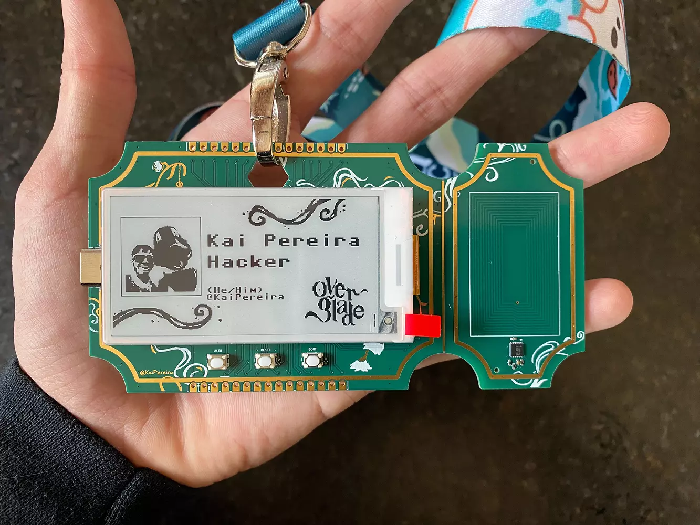
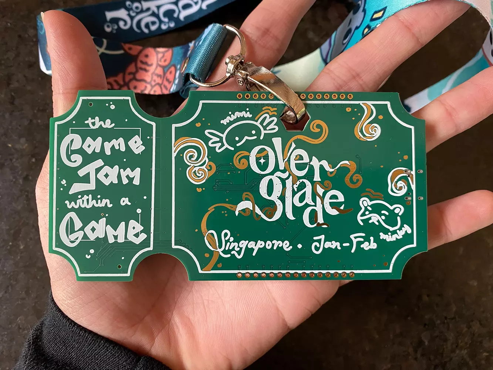

# 内置NFC的自定义电子墨水徽章

凯·佩雷拉为新加坡的 Overglade Hackathon 设计的徽章。由RP2040驱动，拥有NFC、墨水显示屏，使用MicroPython编程。

## 自定义功能

* 无拘无束的NFC点击，满足你内心的任何需求
* 墨水显示屏，无需任何电池
* 20个GPIO
* 如果想做一些更复杂的事情，请使用主动NFC模式
* 零功率，电路板的核心功能无需电源
* 带 4MB 闪存的 RP2040 处理器
* 酷炫的PCB和铜线艺术

## 相关链接

项目文档存放在 github 上，包括了原理图和PCB、自定义固件文件等。

* [github 仓库](https://github.com/KaiPereira/Overglade-Badges)
