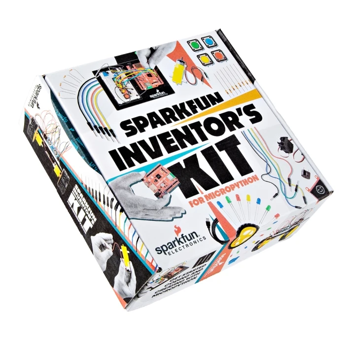
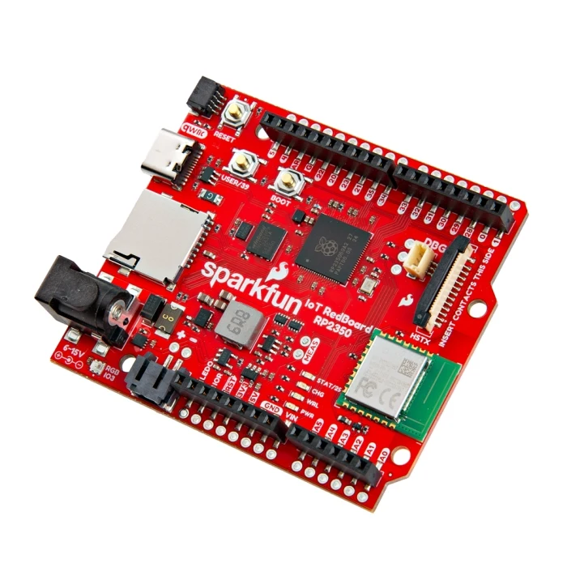

# SparkFun 的 micropython 发明者套件

SparkFun 的 micropython 发明者一体化套件提供了使用 MicroPython 学习嵌入式电子产品所需的一切。该套件将指导完成 16 个互连电路和五个主要项目，从 LED 闪灯开始直到构建自主机器人。不需要任何编程或电子经验！

套件使用 MicroPython 进行编程，它将 Python（世界上最流行的编程语言之一）的简单性和可读性带到物理硬件上。这使得编写与现实世界交互的代码变得异常容易。您可以专注于将您的想法变为现实并理解电子学的核心概念，而不是与复杂的语法作斗争。MicroPython 旨在尽可能与标准 Python 兼容，使您能够轻松地将代码从桌面传输到微控制器或嵌入式系统。

## 基于浏览器的交互式学习

入门套件专为提供无缝的动手体验而设计，直接通过网络浏览器在线使用（ sik.sparkfun.com）。再也不用一个窗口中查看 PDF 指南，又在另一个窗口中进行复杂的编码程序，在线指南基于 JupyterLite Notebooks 构建，这是一个功能强大的工具，可将分步说明和编码环境并排放置。当然也还包括一个实现更传统 IDE 环境的版本！

这种交互式方法允许以最小的、可管理的块编写和运行 MicroPython 代码，并立即看到硬件响应。当按照分步指南操作时，将立即获得反馈，帮助准确了解每个命令如何与硬件交互。无需安装复杂的软件，可以直接开始构建并专注于创作。

## 可扩展和多功能硬件

套件的核心是 SparkFun RP2350 IoT RedBoard，这是一款功能强大的开发板，使用可靠的 Raspberry Pi 系列微控制器。开发板是项目的“大脑”，能够读取传感器、控制电机、显示消息等。一旦掌握了基础知识，其内置的 WiFi 和蓝牙功能也为未来的物联网（IoT） 项目打开了大门。此外 RedBoard 还允许在精通 SIK 电路后扩展到 SparkFun Qwiic 生态系统。Qwiic 生态系统是一个由 I2C 传感器、执行器、屏蔽层和电缆组成的扩展系列，可使原型设计更快、更不易出错。所有支持 Qwiic 的开发板都使用通用的 1mm、4 引脚防呆连接器。这意味着完成指南后，学习之旅也不会停止，MicroPython 的 SIK 是进入无限电子世界的完美平台。

## 相关链接
- [套件入门和指南](https://sik.sparkfun.com)
- [SparkFun 商场](https://notebooks.sparkfun.com/lab/index.html)
- [Jupyter 在线教程](https://notebooks.sparkfun.com/lab/index.html)

