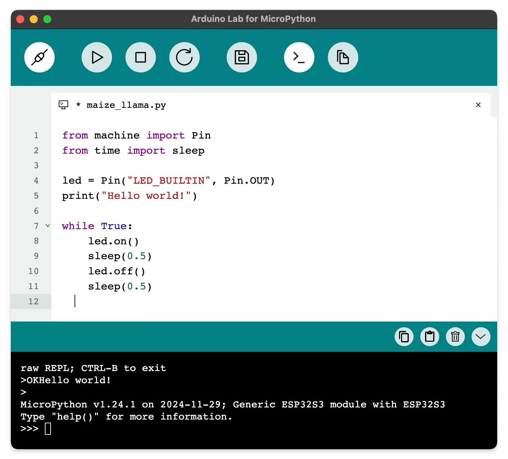

# Arduino Lab for MicroPython

Arduino Lab for MicroPython 是一个轻量级的 MicroPython 程序编辑器，支持连接开发板、代码上传、文件传输，并提供交互式 REPL shell。

- [Arduino Lab for MicroPython 网站](https://labs.arduino.cc/en/labs/micropython)
- [文档](https://docs.arduino.cc/micropython/)
- 软件下载
  - [For Linux (x64)](https://github.com/arduino/lab-micropython-editor/releases/latest/download/Arduino-Lab-for-MicroPython_Linux_X86-64.zip)
  - [For macOS (Universal)](https://github.com/arduino/lab-micropython-editor/releases/latest/download/Arduino-Lab-for-MicroPython_macOS_Universal.zip)
  - [For Windows (x64)](https://github.com/arduino/lab-micropython-editor/releases/latest/download/Arduino-Lab-for-MicroPython_Windows_X86-64.zip)
- [在线版](https://lab-micropython.arduino.cc/)
- [源码](https://github.com/arduino/lab-micropython-editor)
