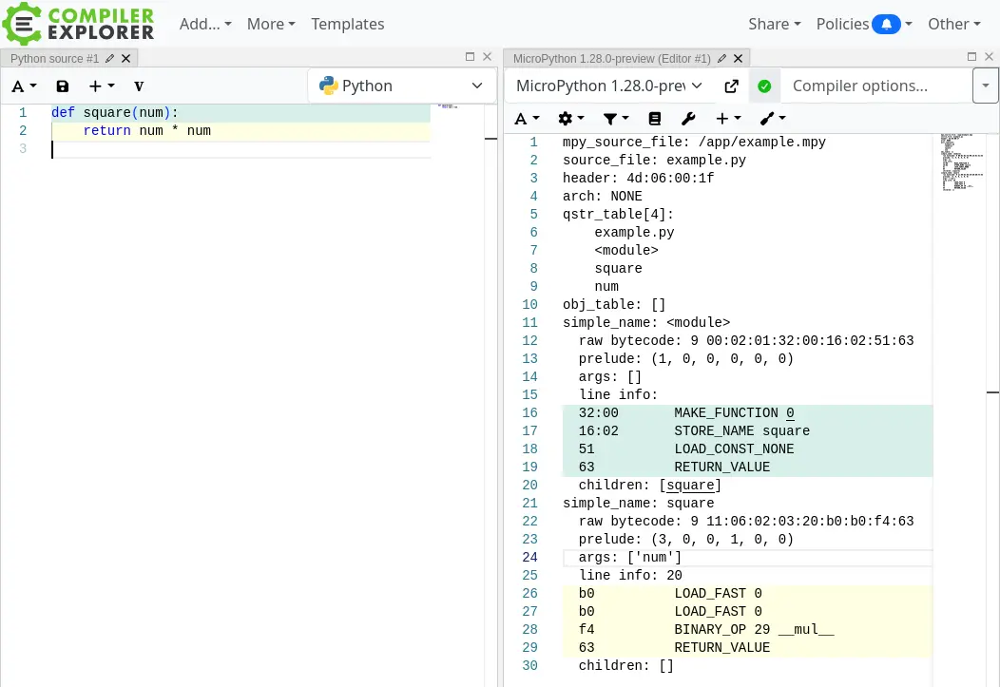

# Compiler Explorer

Compiler Explorer (编译器探索器) 是一个交互式在线工具，开发者可以用多种语言编写代码，并立即查看编译后的汇编输出。

Compiler Explorer 也被称为 Godbolt 编译器探索器，是一个功能强大的基于网络的平台，允许开发人员直接在浏览器中实时编写、编译和分析代码（[https://godbolt.org/](https://godbolt.org/)）。该平台最初于2012年创建，旨在演示C++构造如何转换为汇编代码，此后已扩展至支持30多种编程语言，包括C、C++、Rust、Go、D、Swift、Kotlin、Fortran、Python、Java等。

感谢 Anson Mansfield 的工作，Compiler Explorer 现在已经支持 MicroPython。

