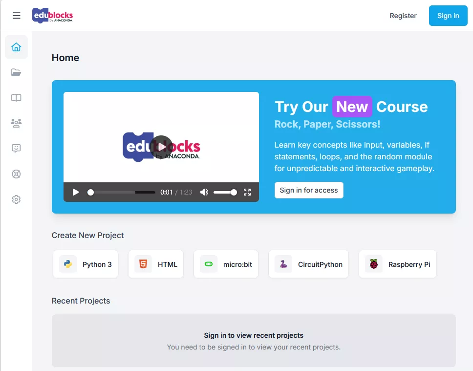
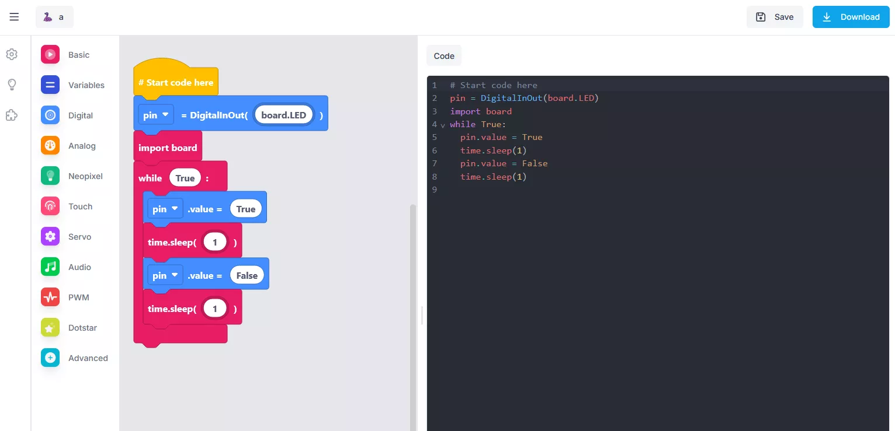

# EduBlocks

EduBlocks 是 Anaconda 的一款免费工具，可帮助任何人使用熟悉的拖放式模块系统，学习使用基于文本的语言(如 Python 或 HTML)进行编程。

**学习语法**，每个模块代表一行代码，使用每个表示一条线的块和代码之间的连接比以往更加容易。文本编辑器还会实时更新被拖入工作区的每个块。

**有趣与引人入胜**，不仅仅是Python，支持HTML、micro:bit、CircuitPython和树莓派,EduBlocks 中有许多内容,可让学生保持参与度并不断学习。

EduBlocks 提供了 Python3、microbit、circuitpython 等在线编程器：

## 在线编程

- https://app.edublocks.org/
