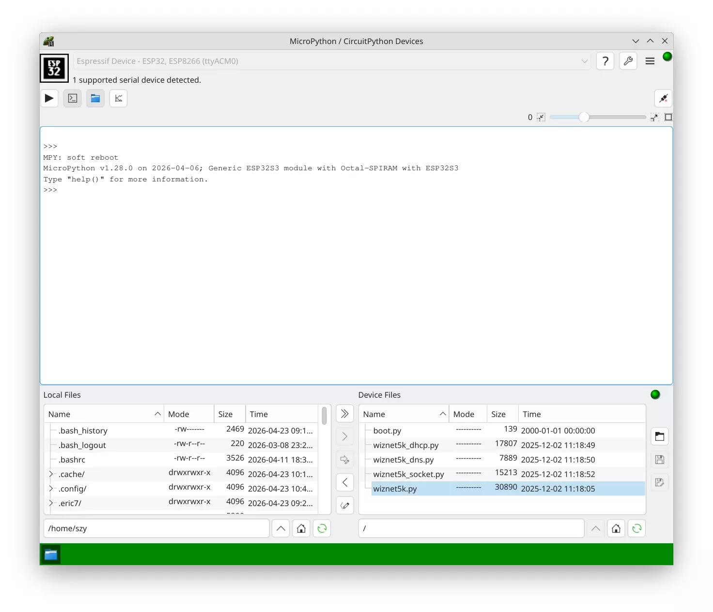

# Eric7

eric7 是一款免费开源的 Python 集成开发环境（IDE），自 1999 年问世以来持续迭代，当前稳定版为 eric7，基于 Python 3.7+、PyQt6（Qt6） 构建。

eric7 中包含了一个 eric7 MicroPython 版本，可以通过串口和 webrepl 连接 micropython/circuitpython 设备。它支持 repl、自带编辑器、支持文件操作和目录同步、一键运行、在线调试、数据图表、固件下载等多种实用功能。

相对于 thonny，eric7 MicroPython 的功能少一些，稳定性也没有 thonny 好，但是带有一些实用功能，可以作为一个备选工具。

eric7 MicroPython 在 debian KDE 中可以直接安装，其它系统可以在官网下载。

- [eric 网站](https://eric-ide.python-projects.org/)
- [软件下载](https://eric-ide.python-projects.org/eric-download.html)
- [文档](https://eric-ide.python-projects.org/eric-documentation.html)
