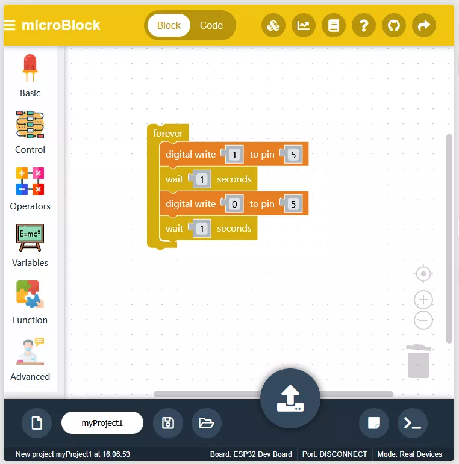
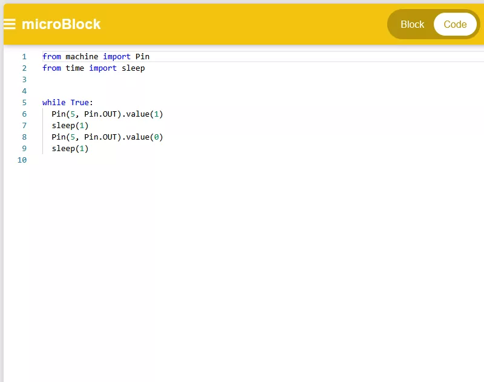

# microBlock IDE

microBlock IDE 是来自泰国的一个在线 micropython 编程工具，可以用积木或代码方式编程。软件提供了丰富的模块，还可以通过外部扩展（上传文件方式）支持更多功能。

microBlock IDE 除了在线版，还提供了离线版本，支持 windows、macOS、ubuntu 等系统。

## 相关链接

- [在线编程](https://ide.microblock.app/)
- [microBlock IDE 源码 (github)](https://github.com/microBlock-IDE/microBlock-IDE)
- [microBlock IDE 离线版 (github)](https://github.com/microBlock-IDE/microBlock-IDE-offline)
