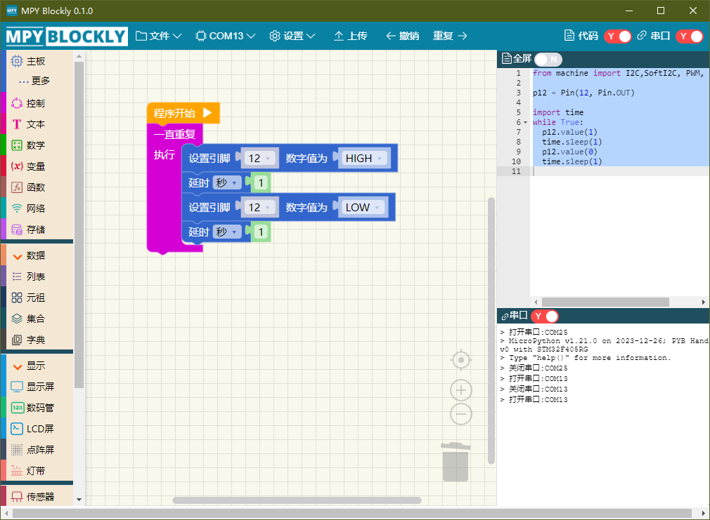

# MPY Blockly

除了使用代码编程，还可以通过图形化方式编程。MPY Blockly 是一个类似 scratch 的软件，通过拖放图形块方式编程。它将常用功能分为多个类别，每个类别下有多个功能积木块（组件），并集成了多种传感器和电子模块的驱动。如果熟悉 scratch 或 makecode 编程，可以很快就掌握 MPY Blockly。

MPY Blockly 可以根据图形自动生成对应代码，可以帮助初学者快速掌握 python 语法和常用方法。虽然 MPY Blockly 主要针对 esp32 编程，生成的代码也是适合 esp32 的，但是一些通用功能在其它硬件上也能使用，只是不能使用 esp32 专有功能。

MPY Blockly的网址：

https://github.com/mpyblockly/mpyblockly.github.io  

**注意：**

- MPY Blockly 目前版本是 0.1.0，软件已经超过 3 年未更新了。
