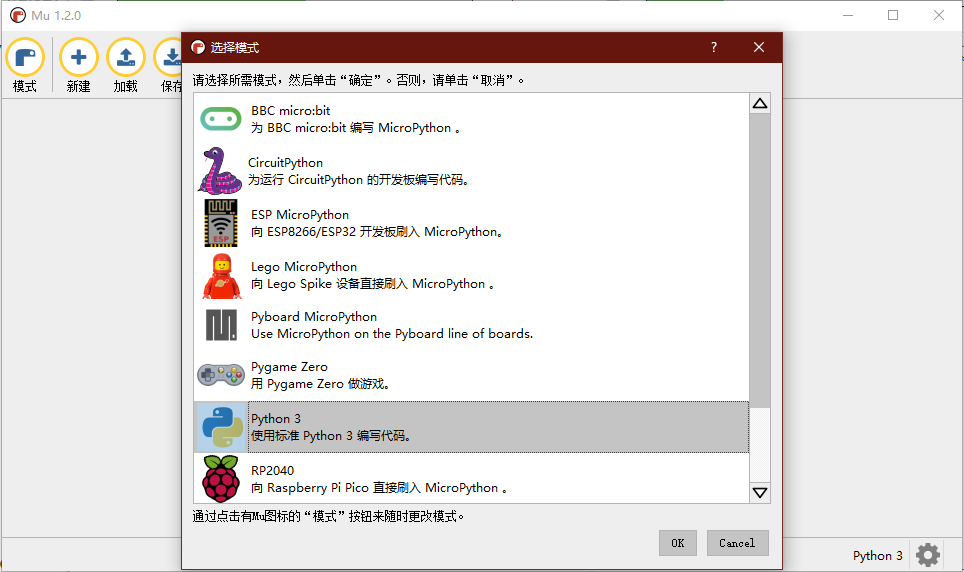
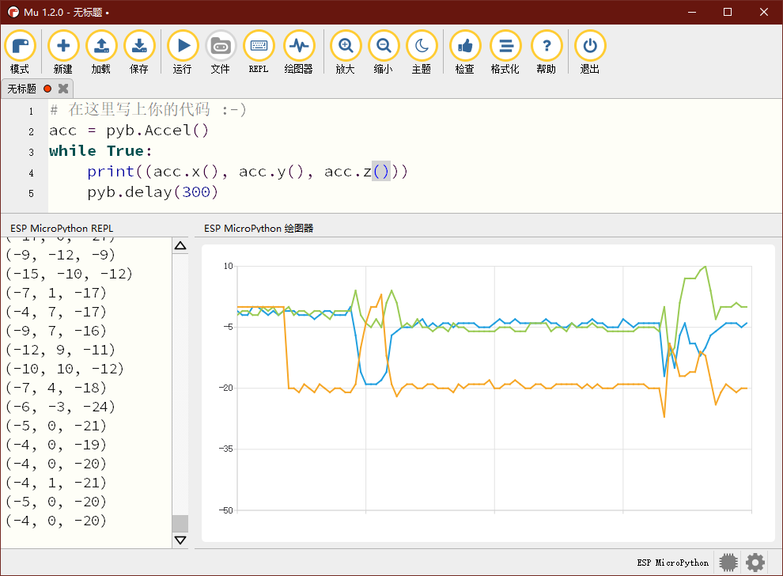

# Mu Editor

Mu Editor（通常简称为Mu）是一个适合初学者的开源python编辑器，它有多种开发模式，适合：microbit、micropython、circuitpython、乐高、PyGame、web等不同硬件和应用。它的语法检查和代码格式化功能等比较有特点。

Mu 同样也支持数据可视化，但是和Thonny的用法稍有区别，它需要将需要显示的数据放在一个元组中。

Mu 同样是一个支持多种操作系统的开源软件，它的下载地址是：

https://codewith.mu/en/download
