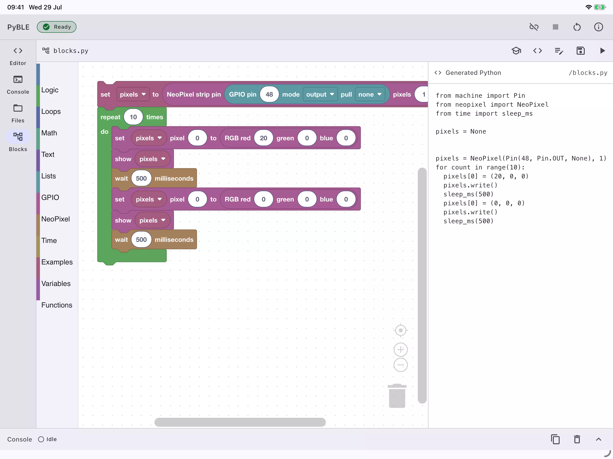

# PyBLE

PyBLE是一个免费的、平板电脑上的 IDE，专为运行MicroPython并支持蓝牙低功耗的开发板而设计。目前固件支持 esp32-4mb、精简通用esp32-s3-n16r8 和 waveshare-esp32-s3-lcd-147b 开发板。ESP32-C3 和更多微控制器系列在计划中。

## 相关链接

- [网站](https://pyble.dev/)
- [github](https://github.com/PyBLE-dev/PyBLE)
