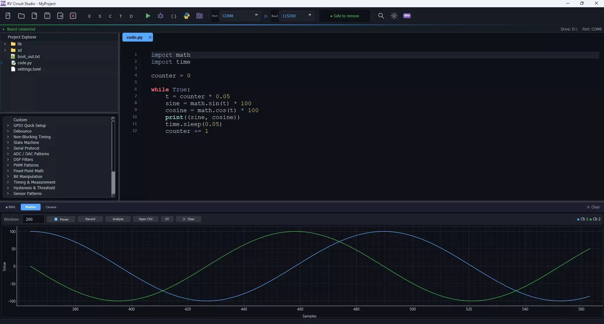
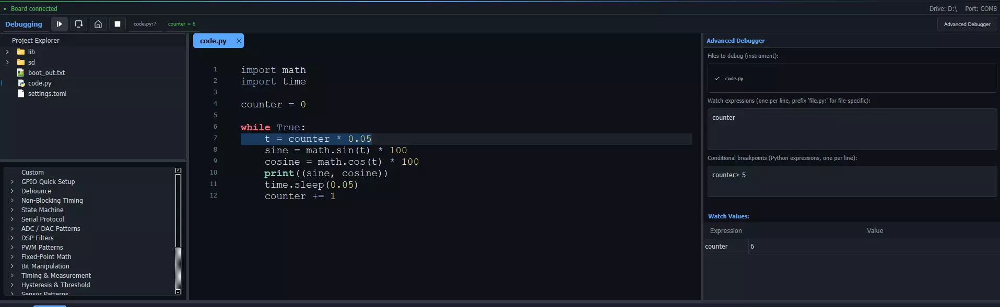
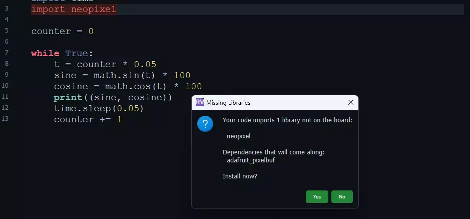
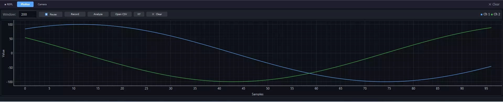
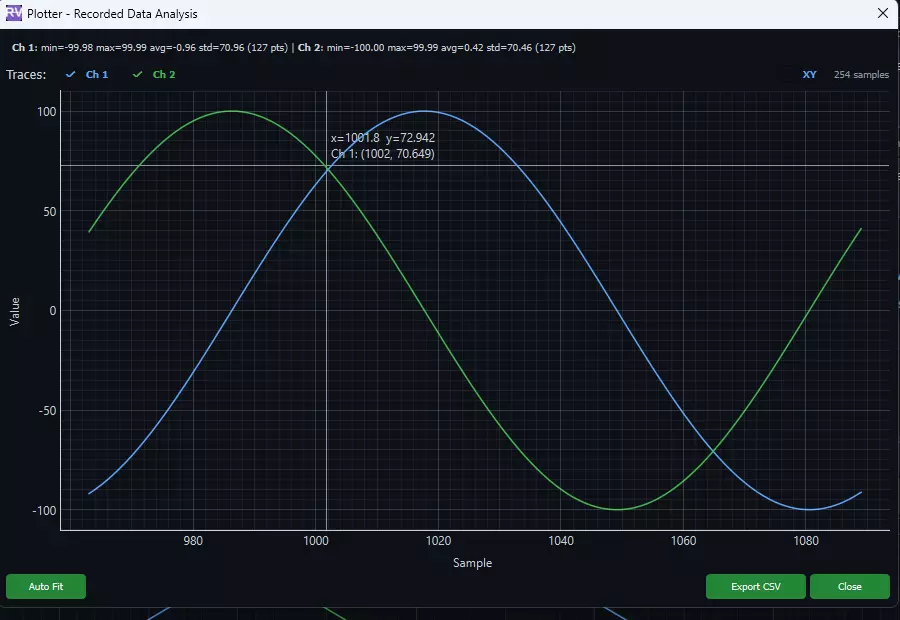
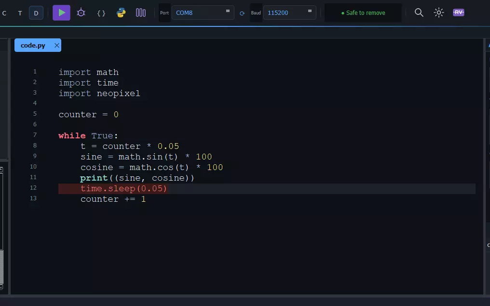
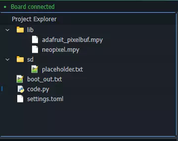
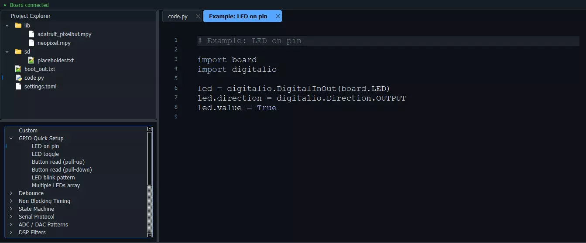
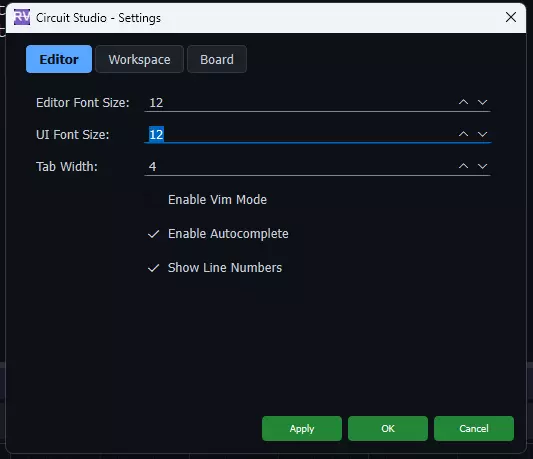

# RV Circuit Studio

桌面版 CircuitPython IDE。隐私优先，功能强大且延迟低，原生性能。Mu Editor 的现代化替代者。

第一个本地化专用 CircuitPython IDE，具有：
- 每次运行时自动备份到主机
- 记录到CSV数据管道（实时记录、自动保存、使用统计数据分析）
- 从board打开CSV进入分析视图
- 带有一键导入感知库管理器的原生IDE
- 集成绘图仪+调试器+库管理器的本地IDE
- 第一个带有只读文件系统错误指南
- 内置代码段系统

原生、高性能的IDE，从一开始就100%离线，没有帐户，没有云。从闪存驱动器运行，非常适合互联网接入不稳定或需要数据隐私的环境。你的代码保留在你的机器上，无需登录，无需遥测，无需“同步到云端”，无延迟或第三方服务器，只有您和您的开发板！

## 主要特点

### 🐞 可视化调试器

CircuitPython的双用途可视化调试器。逐行遍历代码，并在编辑器中突出显示执行的行。具有专用切换窗口的高级视图允许您设置条件断点、实时监视变量以及从顶部重新启动。

### 📦 一键式库管理器

编写代码，IDE会分析您的导入，并一键安装所有必需的库。搜索并浏览整个Adafruit和社区捆绑包。

### 📈 串行绘图仪

实时流式绘图仪，处理每种CircuitPython打印格式：元组、CSV、空格分隔和标记值。只需单击一下即可录制会话，用于相位图、李萨如图形和螺旋的XY参数化模式。

### 📊 数据分析

点击记录，捕获传感器数据，然后打开分析视图。缩放、平移、每点悬停、可点击图例以显示和隐藏轨迹，以及每通道统计数据（最小/最大/平均/标准）。导出到CSV或从电路板加载CSV文件以进行事后分析。

### 💾 自动备份

每次点击运行，您的代码都会保存到板上并自动备份到您的计算机。不用开发板损坏或被擦除，你的代码是安全的。

### 📂 可视化文件管理

像本地驱动器一样管理开发板上的文件。无需离开IDE即可创建、编辑和组织。

### 🧩 代码段

现成运行示例库，涵盖GPIO、去抖动、状态机、ADC/DAC、PWM、DSP滤波器、串行协议等。每个代码段在其自己的选项卡中作为一个完整的示例打开。

### 🔤 通用字体缩放

编辑器和UI字体大小可以独立调整。在大显示器上将所有内容设置为16pt，或在笔记本电脑上保持紧凑。

### 📷 摄像头视角

在流媒体、远程学习或协作过程中共享您的微控制器设置。

## 对比

| 功能 |	RV Circuit Studio |	Mu |	Browser based IDEs | 	VS Code + Tio |
| - | - | - | - | - |
| 实时流绘图 | 是 | Broken | Batch only | No |
| 记录和分析数据 | 是 | 否 | 否 | 否 |
| XY / 模式绘图 | 是 | 否 | 是 | 否 |
| 在分析视图打开 CVS| 是 | 否 | 否 | 否 |
| 逐行调试器 | 是 | 否 | 否 | 否 |
| 一键库管理器 | 是 | 否 | 否 | 手动(CircUp) |
| 自动备份到主机 | 是 | 否 | 否 | 否 |
| 离线/本地 | 是 | 是 | 否 | 否 |
| 零安装选项 | .exe download| pip| 是|否 |
|连接时自动启动 | 是 | 否| 无 |否 |
| 代码库管理 | 是 | 否 | 否 | 扩展 |

## 相关链接

- [软件仓库和下载](https://github.com/ArmstrongSubero/rvcircuit-studio)
