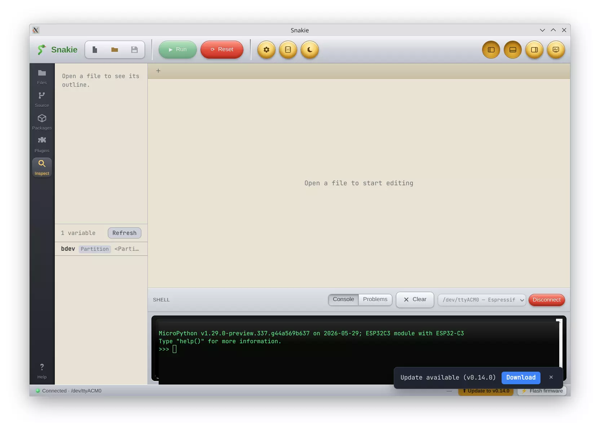

# Snakie

现代化界面的跨平台 MicroPython 编辑器。

Snakie 是一款简洁的 IDE，用于编写 MicroPython 代码并配合连接的微控制器。采用具有深色模式的**Skeuomorph**界面(拉丝金属、绿色毡、格纹纸和凹形玻璃)。它基于 Electron 构建，因此可在 Windows、macOS 和 Linux 系统上运行，并自行进行更新。

除了编辑和REPL功能之外，它还支持可视化电路板 —— 解析代码以绘制实际的引脚 —— 并从正在运行的程序中驱动屏幕上的仪器(示波器、万用表、绘图仪)。

## 特性

### 编辑器
- ✏️ 基于 Monaco 的编辑器，具有 MicroPython 语法高亮显示、自动补全和可选的 AI 幻影文本建议
- 🧩 标签式多文件编辑
- 🔍 查找和替换：大小写/整词/正则表达式切换、实时匹配计数、可拖动对话框
- ✅ 使用曲线图、问题面板和自动修复功能的 YAML/JSON 验证
- 🎨 Skeuomorph 标尺纸张编辑器，带有亮/暗主题切换

### 设备和REPL
- 🔌 通过串口（原始REPL协议）连接到 MicroPython 设备
- ▶️ 运行和停止：当没有运行时，停止也会软复位电路板
- 🐚 交互式shell（REPL），控制台旁边有一个实时串行绘图仪
- 🗂️ 在本地和设备上浏览/创建/重命名/删除文件（Thonny风格）
- 📦 安装 MicroPython 软件包（mip）和📡 闪存固件（内置开发板分类）

### 开发板视图和仪表
- 🔭 一个实时的Board View窗口，解析您的代码以获取引脚使用情况，并绘制实际的电路板：Raspberry Pi Pico 2 W、ESP32、Pimoroni Pico Plus 2/Tiny 2040/Tney 2350，以及您自己的电路板定义
- 🕸️ 按类型（输入/输出/PWM/I²C/SPI/PIO/ADC）显示每个连接的节点图，包括实时引脚值、缩放/旋转/导出（SVG·PNG·PDF），以及用于定制电路板的可视化电路板创建器
- 📟 示波器、万用表和绘图仪：可停靠或浮动，由微型 MicroPython 遥测库（scope() / meter() / plot()）实时、非侵入式输入，一键安装到电路板

### 工作流程
- 🌳 内置版本控制（Git、VS代码风格）
- 🤖 集成 LLM 聊天窗口
- 🔔 新版本就绪时的应用内更新通知

### 技术栈
- Electron：跨平台桌面外壳
- Vite+React+TypeScript：UI 渲染器
- Monaco 编辑器：代码编辑
- **node-serialport**：设备通信（MicroPython 原始 REPL 协议）
- **electron-builder**：Windows/macOS/Linux 的封装

[https://github.com/kevinmcaleer/Snakie](https://github.com/kevinmcaleer/Snakie) 
