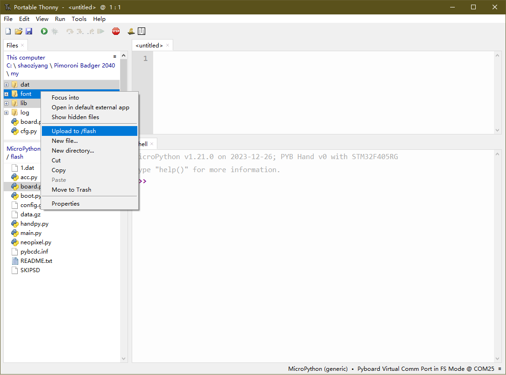
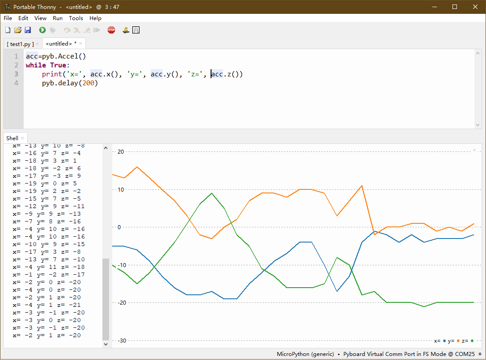

# Thonny


Thonny 是一个简单易用的 Python IDE，支持 windows、Linux、macOS 等操作系统。除了基本的文件编辑、串口终端功能外，它还提供了包括单步执行代码、简单调试器、突出显示语法错误、代码补全、数据可视化等特色功能，是开发 micropython 的重要软件和推荐软件之一。Thonny 支持 Windows、Linux、Mac 操作系统，它也是一个开源软件。

Thonny非常有用的两个功能是文件复制和数据可视化。

* **文件复制**是可以在单片机和计算机之间复制文件，这对于没有提供磁盘接口的esp32、esp8266非常实用。文件功能的使用方法是先在菜单中，点击view(视图) -> File(文件)，软件的最左边就会显示出一个计算机的文件列表，如果连接上了开发板，下方将显示开发板上文件列表。可以在列表上用鼠标左键选择文件或文件夹（按下ctrl键可以一次选择多个文件和文件夹），然后在选择的文件上点击鼠标右键，就可以下载（从单片机复制到计算机）或上传（从计算机复制到单片机）。

    
<br>

* **数据可视化**，将数据以折线图方式显示出来，方便直观的查看数据大小和变化。使用方法是在软件的菜单中，点击view(视图) -> plotter(绘图器)。在程序中，用print语句将数据（数据可以是整数或浮点数）打印出来就能在绘图器中显示出数据折线图。通常在数据前加上名称和等号，这样可以显示出多个数据，每个数据自动以不同颜色显示。如下面程序可以显示出pyboard上加速度传感器的三个方向上的数据折线图：  

  ```
  acc=pyb.Accel()
  while True:
      print('x=', acc.x(), 'y=', acc.y(), 'z=', acc.z())
      pyb.delay(200)
  ```

  

### 链接
- [软件网站](https://thonny.org/)
- [github](https://github.com/thonny/thonny/)