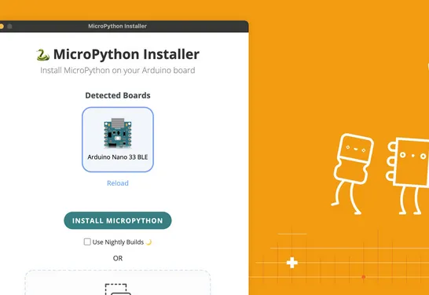

# Arduino Micropython Installer

**MicroPython Installer**是一个独立的工具，用于在支持的Arduino开发板上安装 MicroPython 固件。它会自动检测已连接的板，下载最新的 MicroPython 固件并安装。所有操作只需点击一次鼠标即可完成。

**目前[支持的板卡](https://github.com/arduino/lab-micropython-installer#-supported-boards)**：

- Arduino Portenta H7
- Arduino Portenta C33
- Arduino Nicla Vision
- Arduino Giga
- Arduino Nano RP2040
- Arduino Nano ESP32
- Arduino Nano 33 BLE

**相关链接**：
- [软件网站](https://labs.arduino.cc/en/labs/micropython-installer)
- [软件下载](https://github.com/arduino/lab-micropython-installer/releases/latest)
