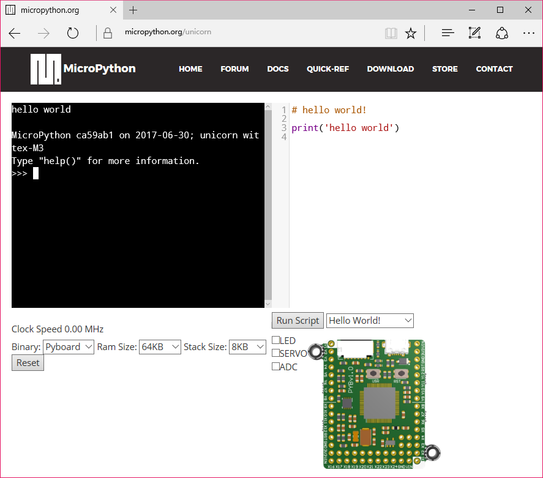
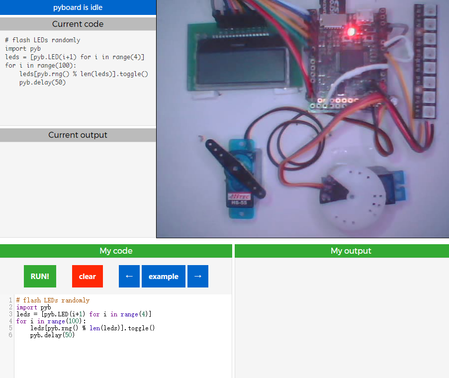

## Unicorn

MicroPython 官方网站上提供了一个在线模拟运行的环境 unicorn，让我们可以通过浏览器去运行和体验 MicroPython。这个在线演示环境可以运行各种例程，查看特定外设和功能模块，如 LED、GPIO、ADC、按键、舵机驱动、延时、数学计算等，可以实时看到 LED 的变化，但是不支持 I2C、SPI、UART、定时器等硬件功能，因为这个在线演示实际上是通过 QEMU 软件进行模拟的，并不是在真正开发板上运行，所以不能完全真实模拟硬件所有功能。

* 在线仿真运行网址：https://micropython.org/unicorn
* unicorn 的源码：https://github.com/micropython/micropython-unicorn

早期的在线演示 (http://micropython.org/live/) 是在真正开发板上运行的（这个在线演示现在仍然可以使用），但是访问速度很慢，因为只有一个开发板，一次只能有一个用户访问，但可能会有很多用户排队访问，同时还会受到网速的限制。它连接到一个 PYB V10 开发板上，并连接到舵机、液晶、WS2812 等模块，通过摄像头将运行情况拍摄回来。如果有多人同时访问，会建立访问队列，依次进行使用。

