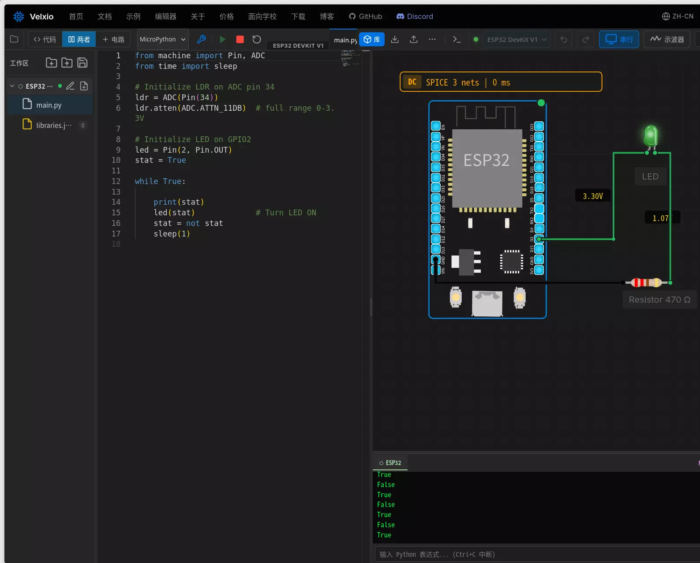

# Vlexio

Velxio 是一个类似 wokwi 的开源仿真器软件，它完全在浏览器中运行，可以编写和仿真 Arduino C++/micropython 代码，支持 48 个以上的交互式电子组件。

除了在线模式外，它还支持桌面版本软件，可以离线方式运行。

## 相关链接

- [网站](https://velxio.dev)
- [在线编辑器](https://velxio.dev/zh-cn/editor)
- [文档](https://velxio.dev/zh-cn/docs)
- [软件下载](https://velxio.dev/account/desktop-install)
