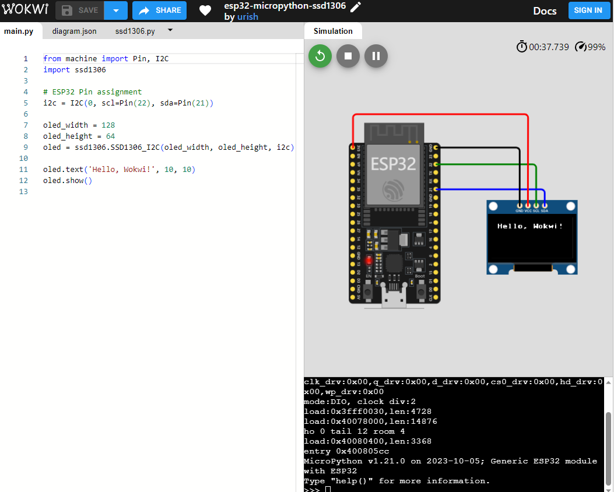
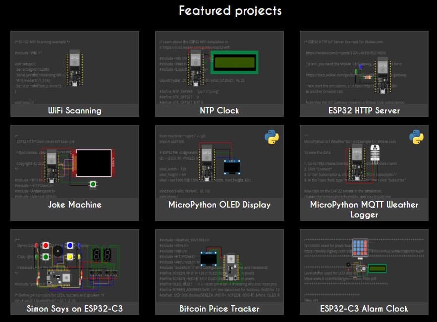

# wokwi

除了 micropython 官方提供的模拟运行环境，还有一个不错的第三方在线模拟运行环 境 wokwi（它的官网地址是 https://wokwi.com/） 。 wokwi 可以模拟运行 STM32、ESP32、Pi Pico、Arduino 等硬件，并且提供了众多的外设和非常绚丽的可视化模拟运行效果，可以逼真的模拟 WS2812、OLED、1602 液晶、数码管、旋钮、RTC、温湿度传感器等多种电子元件。它最早是 arduino 的在线模拟器，现在也支持rust、micropython 的模拟运行功能。wokwi 在浏览器左边编写代码，右边的画布中添加元件，通过鼠标就可以拖拉导线和元件，改变颜色和方向，鼠标滚轮缩放画布。能够随时在左边的代码区修改程序，然后马上看到效果，比在真正的开发板上还快捷方便。

注意第一次运行时可能会比较慢，这与网络有一定关系，因为浏览器需要先在后台下载和缓存一些程序。如果长时间还没有开始运行，可以尝试刷新页面，重新加载程序。

wokwi 带有丰富的 arduino、C、micropython 例程，用户之间也可以共享或者分享自己的程序。注意只有带有 python logo 标志的程序才是 micropython 程序。

- [wokwi仿真效果](wokwi仿真效果/readme.md)
