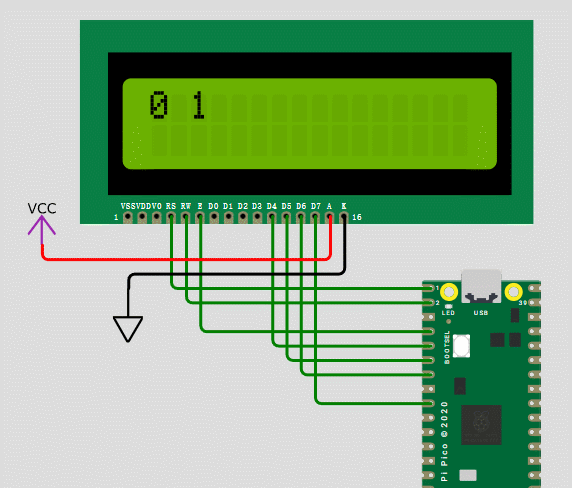
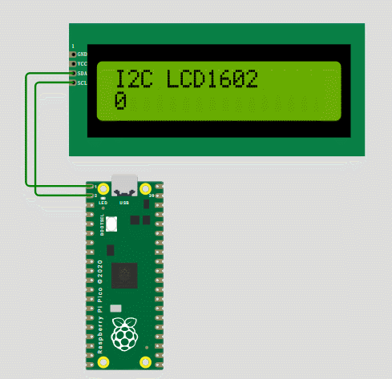
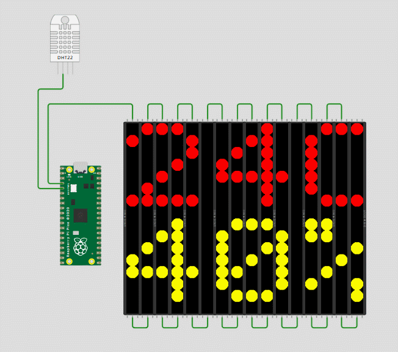

# wokwi

wokwi 在线仿真，无需安装任何软件，通过主流浏览器就可以使用。仿真程序可以通过链接打开，或者在 [wokwi](https://wokwi.com/projects/new/micropython-pi-pico) 网站上，将 zip 文件内的内容复制到 `diagram.json`、`main.py`，并将相应驱动文件（如果存在）上传后使用。

## 显示

### LCD1602

4 位方式驱动 LCD 16x2 字符型液晶

https://wokwi.com/projects/465884703714579457

- [lcd1602_4bit_mode.zip](lcd1602_4bit_mode.zip)

### I2C LCD1206

i2c 接口 LCD1206 液晶。仿真器内置的 LCD1206 设备地址是 `39`。

- [i2c_lcd1206.zip](i2c_lcd1206.zip)

### neopixel 16x16 点阵

https://wokwi.com/projects/465793182369353729 
- [ws2812-16x16-with-dht22.zip](ws2812-16x16-with-dht22.zip)

