# 在 proteus 中仿真 micropython 程序

Proteus 是一个支持仿真单片机的EDA软件，以前经常用来仿真 51、avr、pic、msp40等单片机，后来也逐步支持Arduino、树莓派和STM32，而在最新版本（v8.17 sp4）的 proteus 中，开始支持 micropython 仿真。下面就展示怎样使用 proteus 仿真 micropython 程序、仿真的效果，以及仿真中的一些问题。

首先需要安装新版本的 proteus 软件（版本大于 9.0），然后新建一个项目，并选择项目的名称和位置：

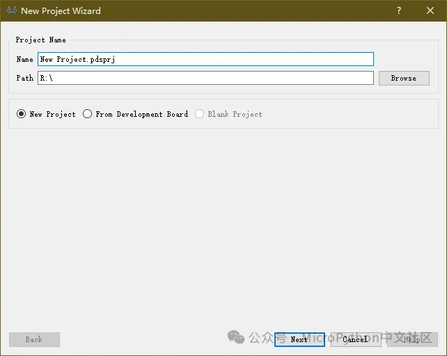

在项目向导中，选择创建原理图。

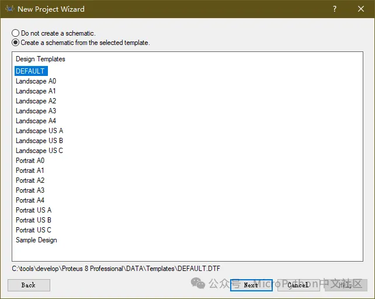

如果只是为了仿真，可以不用创建 PCB 文件。


然后选择创建固件项目（Create Firmware Project），并在系列（Family）中选择 MicroPython：

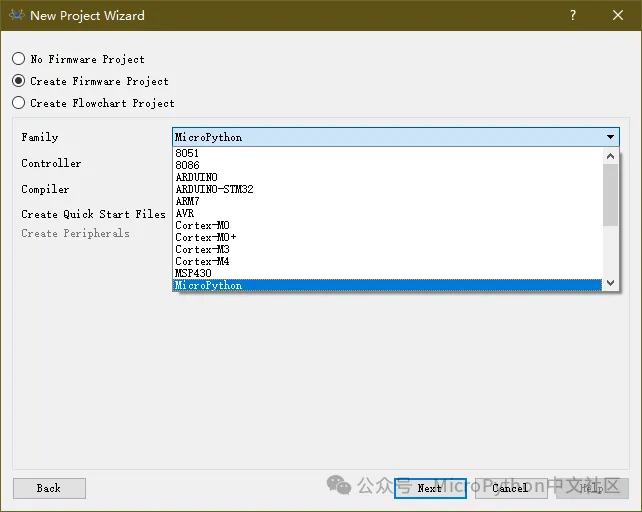

接下来在控制器（Controller）中选择 PI PICO，也就是树莓派的RP2040。目前 proteus 支持 ESP32-S3 和 RP2040 两种型号的微控制器，推荐选择 PI PICO，因为目前软件对 ESP32-S3的支持不太完善，部分硬件功能还不能正常仿真，如硬件 I2C 功能。

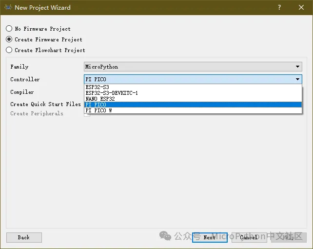

确认参数无误后，单击 FInish 按钮完成项目设置。

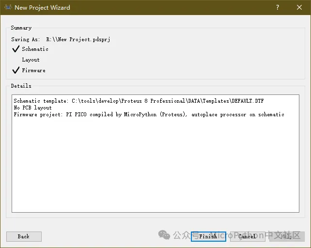

完成项目设置后，就会显示如下界面：包含了原理图和代码编辑。原理图部分已经包含了 RP2040（和PI PICO开发板一样，GPIO25连接到内部的LED，可以直接使用），代码编辑区中显示了默认的代码模板。


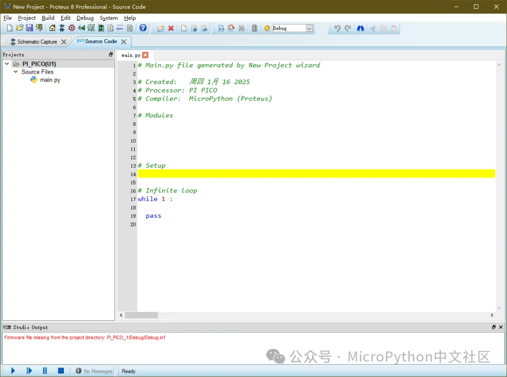

然后就可以和仿真其它电路一样，先添加各种元件，然后连接信号，再编写 MicroPython 代码，添加各种 MicroPython 库，最后进行仿真，验证电路设计或程序功能。我们先在器件库中查找 I2C LCD，找到 I2C-16x2，也就是 I2C 接口的 LCD1602。

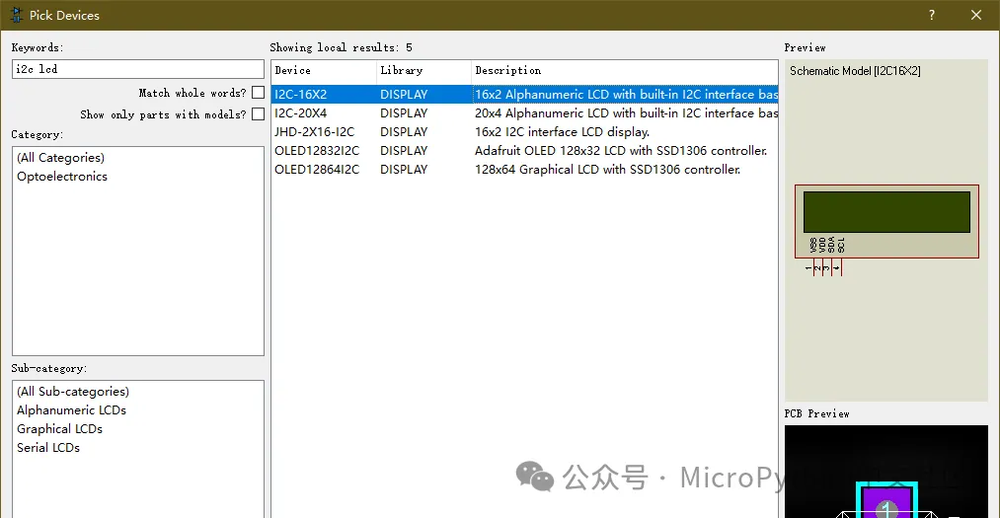

添加元件到原理图，连接 LCD1602 的 VDD和VSS，再将 SDA/SCL 连接到 RP2040 的 GP0/GP1，这两个GPIO被用于 I2C0（注意RP2040的硬件I2C只能使用几个特定引脚，而不是像ESP32那样任意引脚都可以）。这里省略了 I2C 的上拉电阻，它对仿真结果没有太大影响。

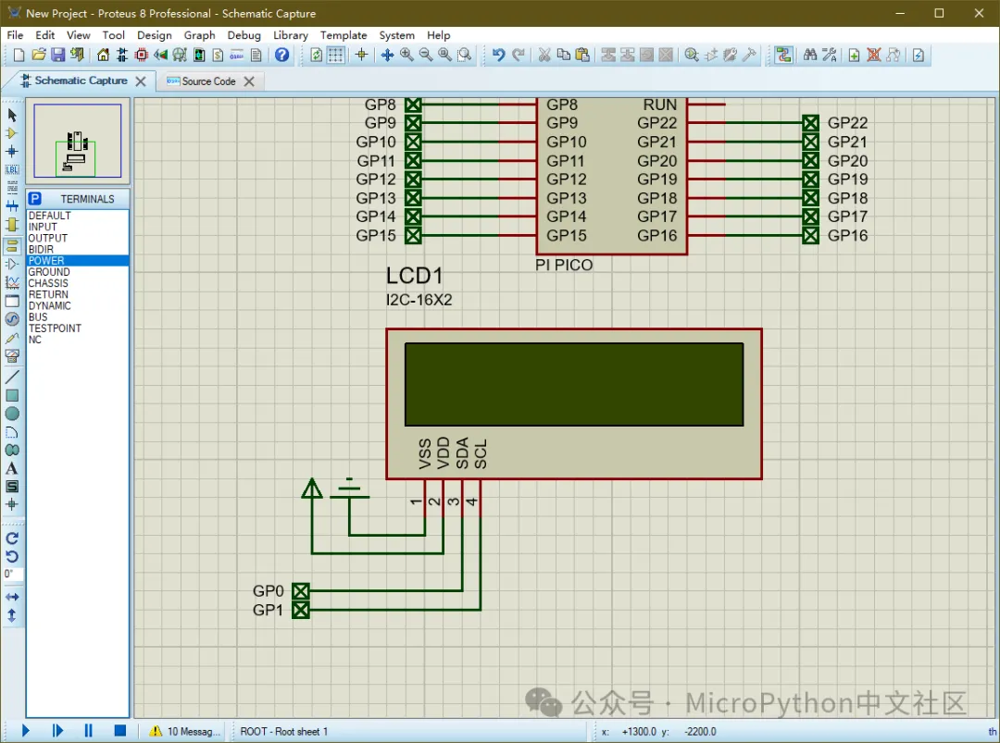

在代码编辑器先输入下面代码，用 i2c.scan() 搜索一下器件地址：

```python
from machine import Pin, I2C

i2c = I2C(0, scl=Pin(1), sda=Pin(0))

print(i2c.scan()) 
```


按下左下角的运行按钮，开始进行仿真，如果没有错误，就可以看到下面的结果，显示搜索到地址为63的设备。如果出现错误就检查连线和代码，查找问题。

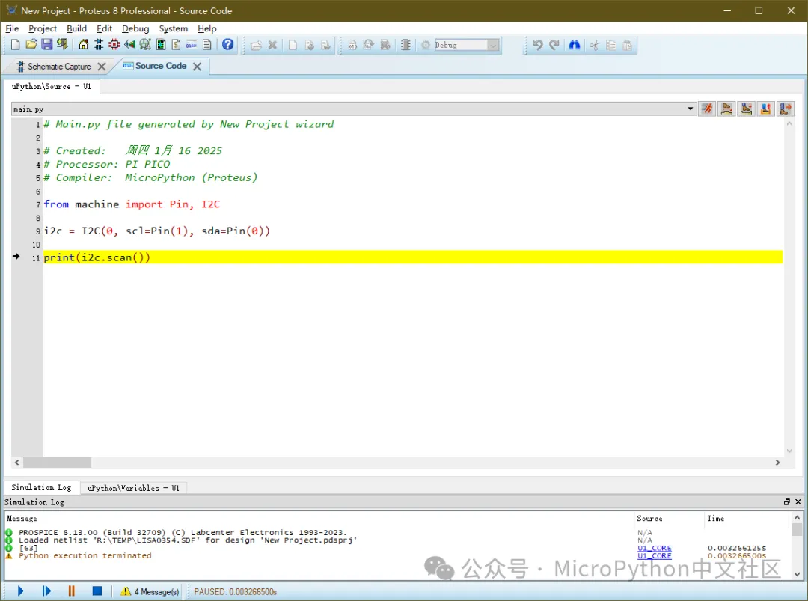

停止仿真，先从 github 或 gitee 下载社区的 i2c lcd1602的驱动库（https://gitee.com/microbit/mpy-lib/blob/master/lcd/I2C_LCD1602/i2c_lcd1602.py），从菜单中选择 project -> Add File，并选择下载后的 i2c_lcd1602.py 文件。


这样就可以将 i2c_lcd1602.py 文件添加到项目中，并在程序中使用了。

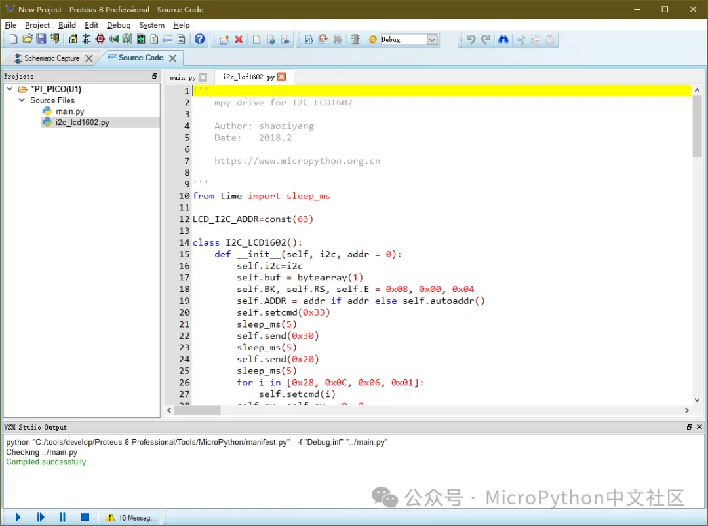

在 `main.py` 中编写一段测试代码，它先创建一个 i2c 对象，再创建一个 LCD1602 实例，最后在屏幕上显示一个不断递增的数字：

```python
from machine import Pin, I2C
from i2c_lcd1602 import I2C_LCD1602
from time import sleep_ms

led = Pin(25, Pin.OUT)
i2c = I2C(0, scl=Pin(1), sda=Pin(0))

print(i2c.scan())

lcd = I2C_LCD1602(i2c, 63)

n = 0

while 1:
    lcd.puts(n, 0, 0)
    n += 1
    sleep_ms(1000)
```

运行仿真，我们就能看到下面的结果。如果搭建实际电路，可以看到仿真的效果和实际硬件上运行是一致的。

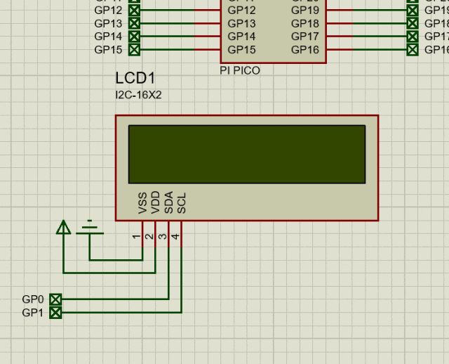

再从元件库中查找并添加一个 BME280 （温湿度、气压传感器），并将它的各引脚连接起来，I2C接口和LCD是共用的。为了方便，这里将BME280的SDO引脚连接到了VCC，也就是设备地址为 0x77。

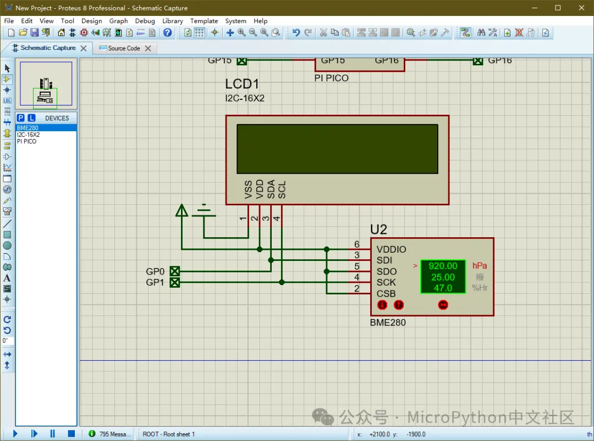

从社区的驱动库中（[https://gitee.com/microbit/mpy-lib/blob/master/sensor/bme280/bme280.py](https://gitee.com/microbit/mpy-lib/blob/master/sensor/bme280/bme280.py)）下载BME280的驱动，并添加到项目中。

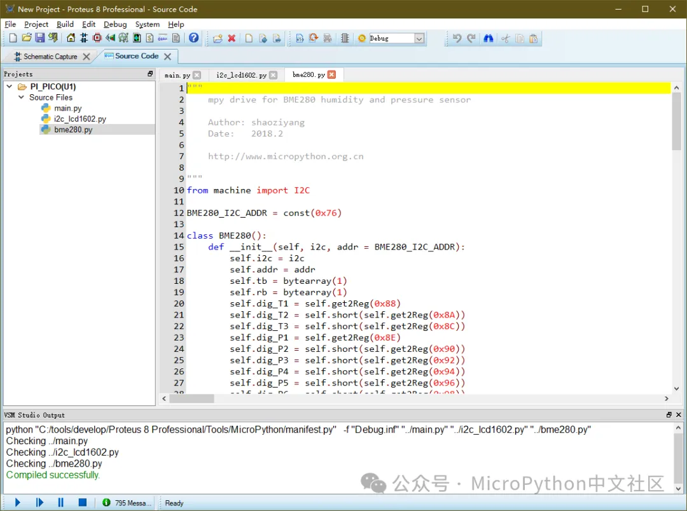

修改`main.py`，添加相关代码：

```python
from machine import Pin, I2C
from bme280 import BME280
from i2c_lcd1602 import I2C_LCD1602
from time import sleep_ms

led = Pin(25, Pin.OUT)
i2c = I2C(0, scl=Pin(1), sda=Pin(0))

print(i2c.scan())

bm = BME280(i2c, 0x77)
lcd = I2C_LCD1602(i2c, 63)

n = 0

while 1:

   led(not led())

   n+=1

   lcd.puts(n, 0, 0)
   lcd.puts(f"{bm.getHumi():.1f}%", 7, 0)
   lcd.puts(f"{bm.getTemp():.1f}C", 0, 1)
   lcd.puts(f"{bm.getPress()/100:.1f}P", 7, 1)

   sleep_ms(500)
```


仿真运行，就可以在LCD上看到传感器的数值。仿真时，可以通过 BME280 下方的三个红色按钮，改变传感器的数值，在屏幕上可以看到采集的数据会同步变化。

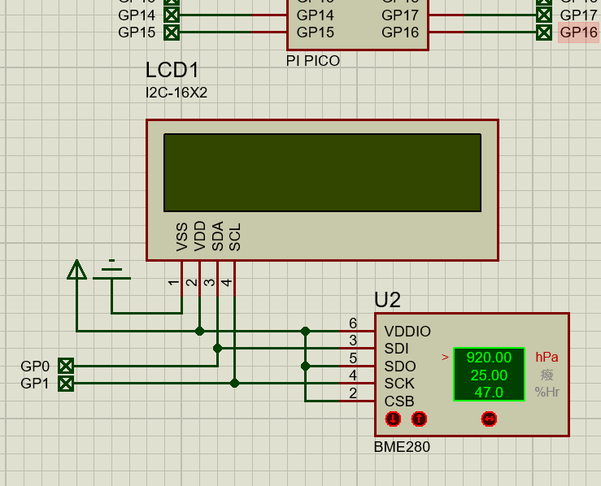

从上面的过程中可以发现，使用 proteus 可以方便的使用 micropython 调试电路，简化开发过程。

[更多仿真程序](../proteus仿真/readme.md)
