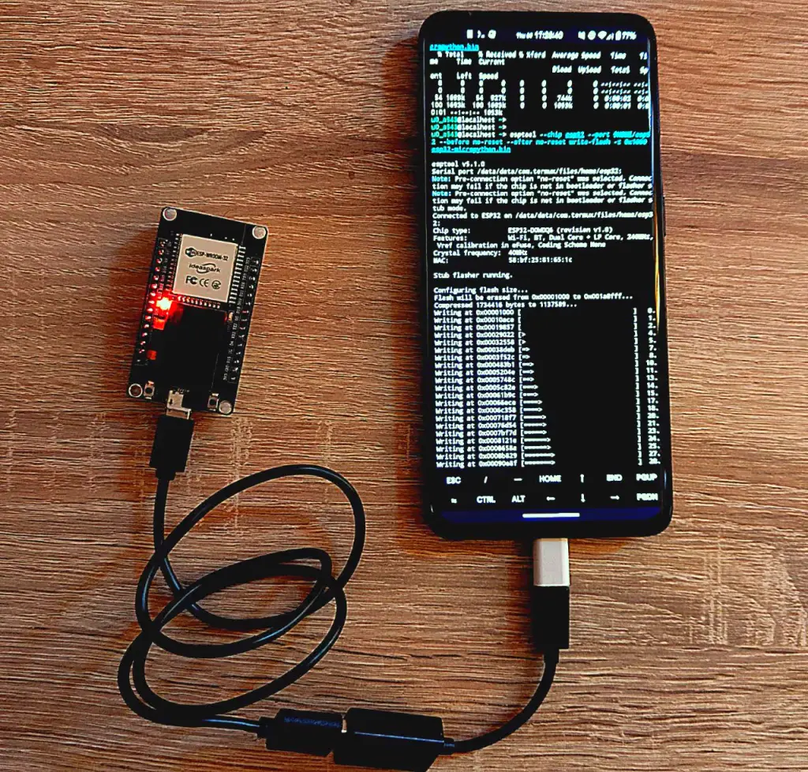
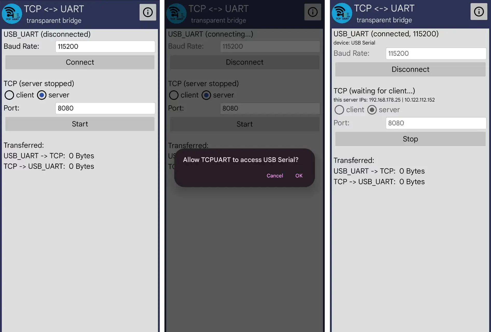
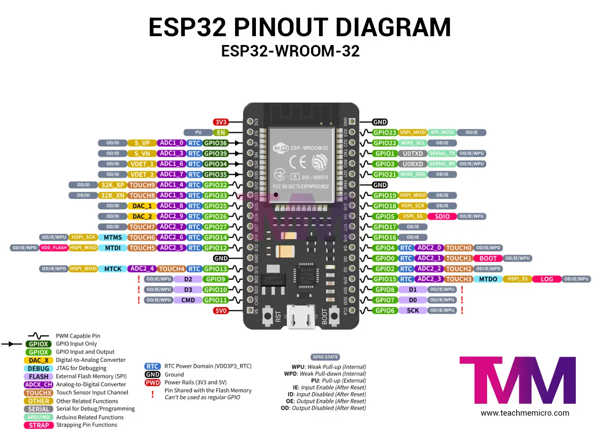
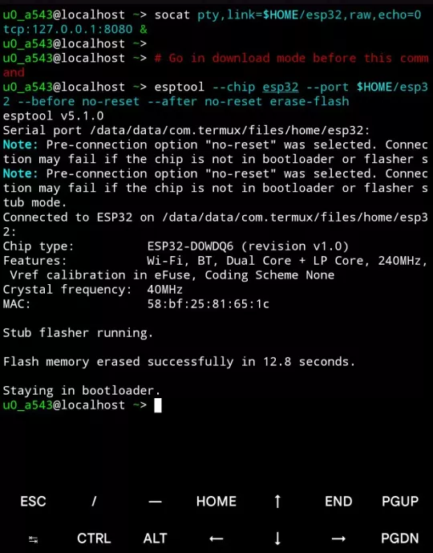
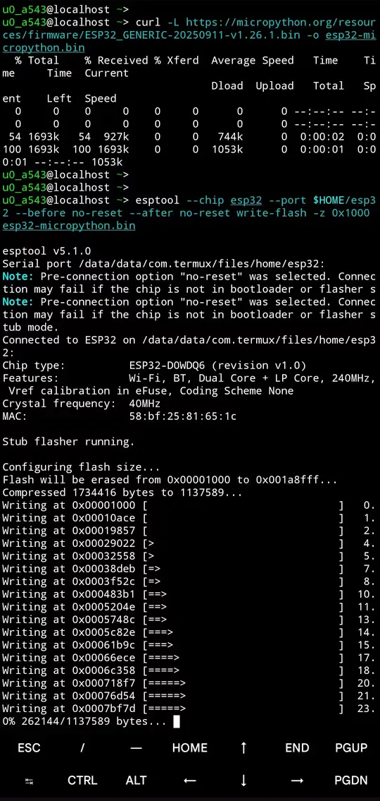
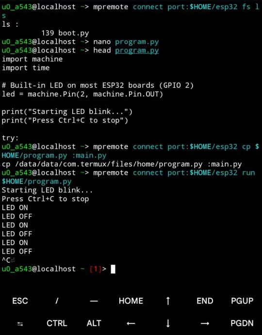

# 在安卓上通过 Termux 上使用 ESP32

翻译整理自：[https://blog.gavide.dev/blog/esp32-and-termux](https://blog.gavide.dev/blog/esp32-and-termux)

对于遵循本指南可能发生**的任何损失概不负责** ，这是出于教育目的而编写的。

如果您像我一样，您可能会喜欢在手机上做一些原本可以通过计算机完成的事情。我想在手机上玩 ESP32-WROOM-32 开发板，但显然没有专门针对 Termux 的在线指南，所以我想记录一下有用的步骤，作为我自己和他人的未来参考。


## 要求
- 任何 ESP32 开发板都可以，这里使用了 ESP32-WROOM-32
- OTG 适配器
- USB 数据线
- 安装了 Termux 的手机（最好是通过 F-Droid 安装）


## 开始
第一件事是安装 [TCPUART transparent Bridge](https://play.google.com/store/apps/details?id=com.hardcodedjoy.tcpuart)，此应用程序将充当 android 串行 USB API 和 Termux 之间的桥梁。它将公开一个本地双向 TCP 服务器，该服务器将数据转发到 UART 或从 UART 转发（安装第三方应用程序并不方便，另一种选择是通过 [Termux-API](https://f-droid.org/packages/com.termux.api/) 使用 termux-usb，但我经常面临断开连接和设置问题，所以我选择了这个应用程序）。

## TCPUART Setup  TCPUART 设置
* 波特率设置为 `115200`
* 按下 `连接` 按钮
* 单击出现的`确定`按钮
* 在 `客户端` 和 `服务器` 之间，选择 `服务器`
* 使用 `8080` 作为端口
* 单击 `开始` 按钮


## Termux setup  Termux 设置
- 在 Termux 中，输入下面命令安装程序：

```
pkg install -y python esptool mpremote socat
```
- 然后，设置一个 TCP 桥接虚拟设备文件

```
socat pty,link=$HOME/esp32,raw,echo=0 tcp:127.0.0.1:8080 &
```
如果执行成功，该命令不应打印任何输出， `socat` 将在后台运行。将在 Termux 主文件夹中创建一个名为 `esp32` 的文件。

## 擦除 ESP32



进入下载模式：
- 按住板上的物理 `BOOT` 按钮。
- 按下并松开 `EN/ENABLE` `/` `RST`/ `RESET` 按钮（基本上是另一个按钮）
- 松开 `BOOT` 按钮


在 Termux 上运行以下命令，擦除 flash
```shell
esptool --chip esp32 --port $HOME/esp32 --before no-reset --after no-reset erase-flash
```



## 写入 Micropython 固件
从 [https://micropython.org/download/ESP32\_GENERIC/](https://micropython.org/download/ESP32_GENERIC/) 获取最新固件（根据实际情况修改文件名）。
在 Termux 上运行这些命令以下载并刷新固件。请记住**在运行第二个命令之前进入下载模式** ：
```shell
curl -L https://micropython.org/resources/firmware/ESP32_GENERIC-20250911-v1.26.1.bin -o esp32-micropython.bin

esptool --chip esp32 --port $HOME/esp32 --before no-reset --after no-reset write-flash -z 0x1000 esp32-micropython.bin
```

下载完成后，按下并松开板上的 `ENABLE/` `RESET` 按钮以退出下载模式。



## 后续步骤
运行以下命令进入 Micropython REPL
```shell
mpremote connect port:$HOME/esp32 repl
```

或者用 minicom
```shell
minicom -D $HOME/esp32 -b 115200  # Quit using Ctrl-A Q
```

上传代码
```shell
mpremote connect port:$HOME/esp32 cp $HOME/program.py :main.py
```

运行代码
```shell
mpremote connect port:$HOME/esp32 run $HOME/program.py
```



### 一些有用的 mpremote 命令
列出文件
```shell
mpremote connect port:$HOME/esp32 fs ls
```

查看文件
```shell
mpremote connect port:$HOME/esp32 fs cat main.py
```

删除文件
```shell
mpremote connect port:$HOME/esp32 fs rm unwanted.py
```

交互式 REPL
```shell
mpremote connect port:$HOME/esp32 repl
```
