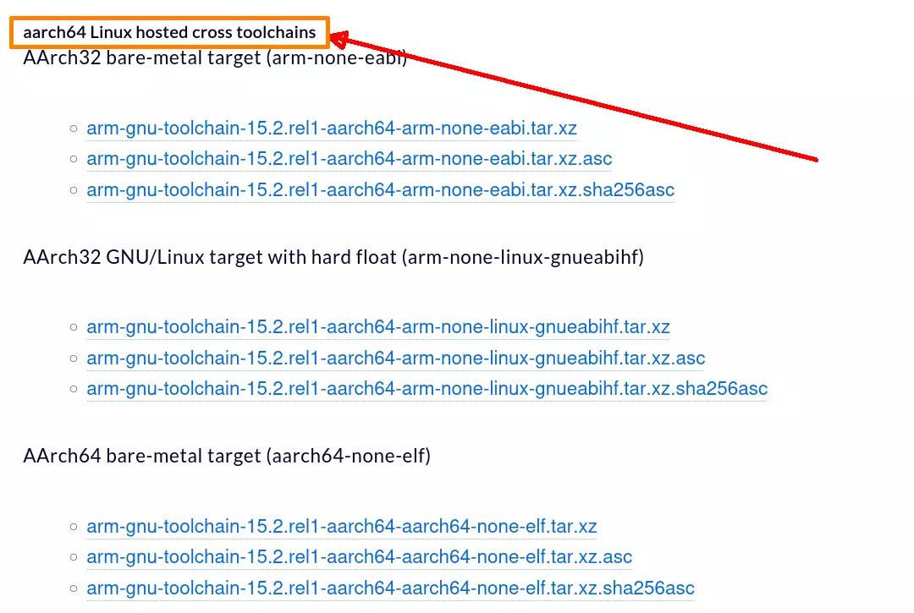

# 在树莓派上编译

在树莓派上编译源码，和PC上是类似的，主要区别在于工具链不同，需要换成 arm 架构的工具链。以 Arm GNU Toolchain 为例，在 Linux/WSL下，需要下载 `x86_64 Linux hosted cross toolchains` 版本的编译器。而在树莓派上，就需要下载 `aarch64 Linux hosted cross toolchains` 版本的编译器。

下载后展开压缩文件，并添加编译器路径到PATH后（参见 [安装编译需要的软件](../安装编译需要的软件/readme.md)），就可以编译了。

