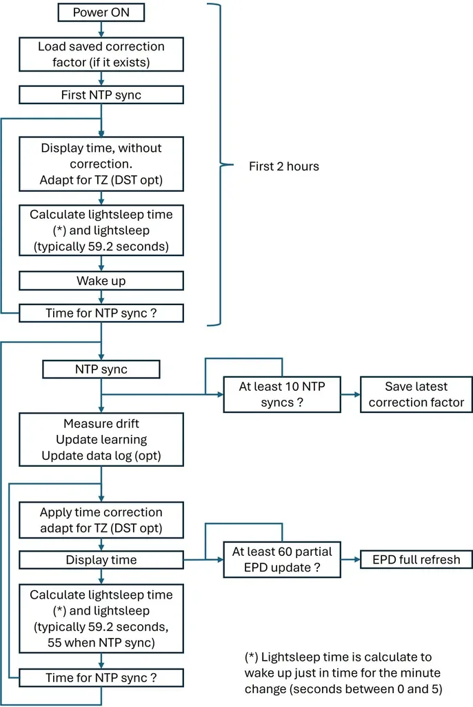
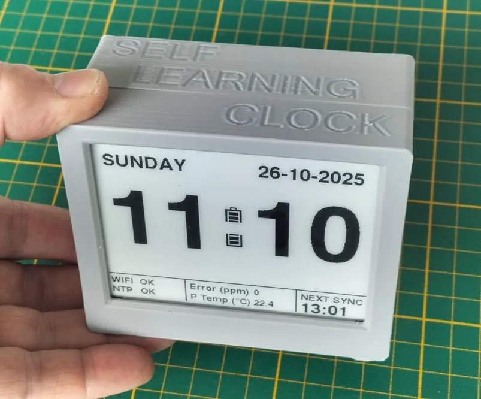

# 自学习时钟

整理自：https://www.instructables.com/Self-Learning-Clock-SLC/ 

自学习时钟 （SLC） 是一种 DIY 时钟，它学习自己的内部漂移，以最小的 NTP 同步保持高精度。

它采用超低功耗开发板，搭配4.2英寸高对比度电子纸显示屏。使用电池供电，平均功耗低于 0.75 mAh，一次充电可持续使用数月。

<video controls autoplay loop>
  <source src="slc.mp4" type="video/mp4">
</video>

## 概念

传统的基于 NTP 的时钟需要经常与时间服务器校正，这会耗尽电量并依赖于连续的网络连接。它们的准确性会漂移，直到下一次同步。

自学习时钟 （SLC） 采用不同的方法：它观察自己的时序误差并为其内部振荡器的漂移构建软件校正模型。通过应用这种自适应校正，它实现了出色的短期精度和最小的长期漂移（最后一个在 NTP 同步时得到完全补偿）。在初始学习期之后，时钟在 12 小时内保持大约 ±2 秒的精度，每天只需两次 NTP 同步。最初的学习大约需要两天时间，但学习过程永远不会停止，使 SLC 能够不断完善其纠正。

## 为什么这很重要

像 ESP32 这样的微控制器包含两种类型的振荡器：
- 大功率模式： 使用稳定、精确的晶体振荡器。
- 低功耗模式（轻度睡眠）： 使用节能但不精确的 RC 振荡器，每天可能会累积几分钟的误差。
虽然带有备用电池的外部 RTC 模块可以解决这个问题，但 SLC 仅使用微控制器本身即可实现类似的精度。这无需任何额外的硬件即可实现真正、持久的电池运行。

## 为什么要“自学习”？

在这种情况下，“学习”指的是一个确定性的自我校准过程。时钟对其自身的硬件特性进行建模和补偿。这不是人工智能，而是一种直接的数学分析。系统将内部时钟偏差（以 PPM 为单位）与可信源（NTP 服务器）进行比较，并对显示的时间应用过滤校正。

## 主要特征：

- 自适应漂移补偿：
	- 通过周期性 NTP 同步学习和校正微控制器的振荡器漂移，从而创建越来越准确的内部时序模型。
	- 无需手动校准谐振器，代码会自动处理补偿。
- 超低功耗：通过超短唤醒（约每分钟唤醒 0.8 秒）实现微调的轻睡眠周期。
- 智能时间管理：自动处理时区和夏令时 （DST），并为不同地区（例如欧盟、美国、澳大利亚）配置可配置规则。

## 补充说明：

学习和校正过程不断适应温度变化或组件老化可能引起的变化。

非常小的占空比 （<1.5%） 极大地限制了微处理器的自热，使其能够“密封”在外壳中。这种隔离可以保护处理器免受室温突然波动的影响，从而实现更稳定的漂移特性。

长期精度验证是一个持续的过程：时钟变得越精确，充分表征其性能所需的测试时间就越长。

## 代码：

https://github.com/AndreaFavero71/Self_Learning_Clock 
