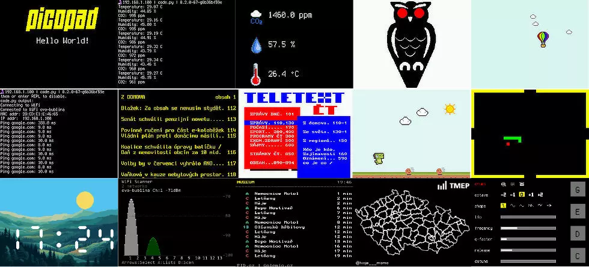
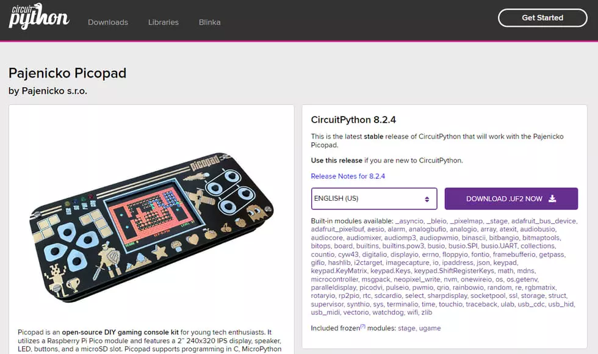

# Picopad Circuitpython 教程

CircuitPython初学者指南！本教程旨在介绍使用 CircuitPython 的微控制器世界。在本指南末尾，将充分了解如何使用 CircuitPython 对 PicoPad 中的树莓派 Pico 等设备进行编程，以及多种硬件组件的接口，并创建交互式项目。

CircuitPython 是一款专为微控制器定制的 Python 用户友好版本。它提供了一种从物理计算开始的简单方法，可与传感器、显示器和电机等组件进行交互。

将学到什么:

-	编程的基本原理。
-	与传感器、显示器、按钮和LED连接。
-	收集数据、管理硬件和展示输出的技术。
-	物理计算基础和电路接口。
-	制作包含灯光、声音和图形的项目。
-	开发简单的游戏。
-	将设备与互联网和云服务连接起来。

指南被整理成在复杂性方面取得进展的课程。每节课都包含带注释的代码样本，可以在 PicoPad 或任何其他兼容CircuitPython的设备上使用。

深入探索、实践，使用 CircuitPython 设计自己的创新项目！

## 快速开始

**需要**

- 支持 CircuitPython 的设备，例如 PicoPad 或树莓派 Pico。
- 用于将设备连接到计算机的USB线缆。
- 最新的 CircuitPython UF2 固件镜像。

## 相关链接

https://github.com/MakerClassCZ/Picopad/tree/CircuitPython/circuitpython
