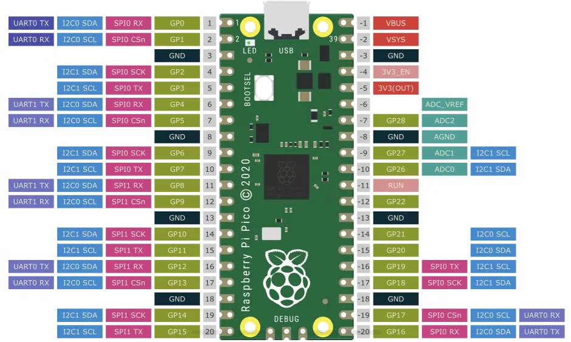

# RP2 快速使用教程



Raspberry Pi Pico 开发板

以下是Raspberry Pi RP2xxx板的快速参考。如果这是你第一次使用该板，先了解一下微控制器的概述可能是有用的：

- [General information about the RP2xxx port](http://docs.micropython.org/en/latest/rp2/general.html)
- [Getting started with MicroPython on the RP2xxx](http://docs.micropython.org/en/latest/rp2/tutorial/intro.html)

---

- [Installing MicroPython](#install)
- [General board control](#General)
- [Delay and timing](#Delay)
- [Timers](#Timers)
- [Pins and GPIO](#Pins)
- [Programmable IO (PIO)](#PIO)
- [UART (serial bus)](#UART)
- [PWM (pulse width modulation)](#PWM)
- [ADC (analog to digital conversion)](#ADC)
- [Software SPI bus](#SoftSPI)
- [Hardware SPI bus](#SPI)
- [Software I2C bus](#SoftI2C)
- [Hardware I2C bus](#I2C)
- [I2S bus](#I2S)
- [Real time clock (RTC)](#RTC)
- [WDT (Watchdog timer)](#WDT)
- [OneWire driver](#onewire)
- [NeoPixel and APA106 driver](#neopixel)

## <a name='install'>Installing MicroPython</a>

请参阅教程的相应部分： [Getting started with MicroPython on the RP2xxx (在RP2xxx上开始使用MicroPython)](http://docs.micropython.org/en/latest/rp2/tutorial/intro.html#rp2-intro)。它还包括一个故障排除小节。


## <a name='General'>General board control</a>

MicroPython REPL是通过USB串行端口访问的。Tab完成有助于了解对象的方法。粘贴模式（ctrl-E）用于将一大块Python代码粘贴到REPL中。

The :mod:`machine` module::

```
import machine

machine.freq()          # get the current frequency of the CPU
machine.freq(240000000) # set the CPU frequency to 240 MHz 
```

The :mod:`rp2` module::

```
import rp2 
```

## <a name='Delay'>Delay and timing</a>

Use the :mod:`time <time>` module::

```
import time

time.sleep(1)           # sleep for 1 second
time.sleep_ms(500)      # sleep for 500 milliseconds
time.sleep_us(10)       # sleep for 10 microseconds
start = time.ticks_ms() # get millisecond counter
delta = time.ticks_diff(time.ticks_ms(), start) # compute time difference 
```

## <a name='Timers'>Timers</a>

RP2040的系统定时器外设提供全局微秒时基，并为其生成中断。目前可使用数量不受限制软件定时器（内存允许时）。无需指定计时器id（目前支持id=-1），因为它将默认为该id。

Use the :mod:`machine.Timer` class::

```
from machine import Timer

tim = Timer(period=5000, mode=Timer.ONE_SHOT, callback=lambda t:print(1))
tim.init(period=2000, mode=Timer.PERIODIC, callback=lambda t:print(2)) 
```


## <a name='Pins'>Pins and GPIO</a>

Use the :ref:`machine.Pin <machine.Pin>` class::

```
from machine import Pin

p0 = Pin(0, Pin.OUT)    # create output pin on GPIO0
p0.on()                 # set pin to "on" (high) level
p0.off()                # set pin to "off" (low) level
p0.value(1)             # set pin to on/high

p2 = Pin(2, Pin.IN)     # create input pin on GPIO2
print(p2.value())       # get value, 0 or 1

p4 = Pin(4, Pin.IN, Pin.PULL_UP) # enable internal pull-up resistor
p5 = Pin(5, Pin.OUT, value=1) # set pin high on creation 
```

## <a name='PIO'>Programmable IO (PIO)</a>

PIO对于从头开始构建低级IO接口非常有用。请参阅：`rp2` 模块以获取 assembly 指令的详细说明。

```
from machine import Pin
import rp2

@rp2.asm_pio(set_init=rp2.PIO.OUT_LOW)
def blink_1hz():
    # Cycles: 1 + 7 + 32 * (30 + 1) = 1000
    set(pins, 1)
    set(x, 31)                  [6]
    label("delay_high")
    nop()                       [29]
    jmp(x_dec, "delay_high")

    # Cycles: 1 + 7 + 32 * (30 + 1) = 1000
    set(pins, 0)
    set(x, 31)                  [6]
    label("delay_low")
    nop()                       [29]
    jmp(x_dec, "delay_low")

# Create and start a StateMachine with blink_1hz, outputting on Pin(25)
sm = rp2.StateMachine(0, blink_1hz, freq=2000, set_base=Pin(25))
sm.active(1) 
```

## <a name='UART'>UART (serial bus)</a>

有两个UART，UART0和UART1。UART0可以映射到GPIO 0/1，12/13 以及 UART1到GPIO 4/5和8/9。

参考 :`machine.UART`

```
from machine import UART, Pin
uart1 = UART(1, baudrate=9600, tx=Pin(4), rx=Pin(5))
uart1.write('hello')  # write 5 bytes
uart1.read(5)         # read up to 5 bytes 
```

**注**

- UART上的REPL在默认情况下被禁用。有关如何通过UART启用REPL的详细信息，请参阅 [Getting started with MicroPython on the RP2xxx (在RP2xxx上开始使用MicroPython)](http://docs.micropython.org/en/latest/rp2/tutorial/intro.html#rp2-intro)。


## <a name='PWM'>PWM (pulse width modulation)</a>

有8个独立的PWM发生器，称为切片，每个发生器都有两个通道，总共有16个PWM通道，可以在125Mhz 时钟下从8Hz到62.5Mhz进行驱动。每个发生器的两个通道以相同的频率运行，但可以具有不同的占空比。这两个通道通常分配给具有偶数/奇数的相邻GPIO引脚对。所以GPIO0和GPIO1在发生器0，GPIO2和GPIO3在发生器1，依此类推。某个通道可以分配给不同的GPIO引脚（参见引脚）。例如，发生器0通道A可以被分配给GPIO0和GPIO16。 

Use the `machine.PWM` class

```
from machine import Pin, PWM

# create PWM object from a pin and set the frequency of slice 0
# and duty cycle for channel A
pwm0 = PWM(Pin(0), freq=2000, duty_u16=32768)
pwm0.freq()             # get the current frequency of slice 0
pwm0.freq(1000)         # set/change the frequency of slice 0
pwm0.duty_u16()         # get the current duty cycle of channel A, range 0-65535
pwm0.duty_u16(200)      # set the duty cycle of channel A, range 0-65535
pwm0.duty_u16(0)        # stop the output at channel A
print(pwm0)             # show the properties of the PWM object.
pwm0.deinit()           # turn off PWM of slice 0, stopping channels A and B 
```

## <a name='ADC'>ADC (analog to digital conversion)</a>

RP2040总共有五个ADC通道，其中四个是基于12位SAR的ADC：GP26、GP27、GP28和GP29。ADC0、ADC1、ADC2和ADC3的输入信号可以分别与GP26、GP27、GP28、GP29连接（在Pico板上，GP29连接到VSYS）。标准ADC范围为0-3.3V。第五通道连接到内置温度传感器，可用于测量温度。

Use the :ref:`machine.ADC <machine.ADC>` class::

```
from machine import ADC, Pin
adc = ADC(Pin(26))     # create ADC object on ADC pin
adc.read_u16()         # read value, 0-65535 across voltage range 0.0v - 3.3v 
```

## <a name='SoftSPI'>Software SPI bus</a>

软件SPI（使用 bit-banging）可在所有引脚上工作，并可通过 `machine.SoftSPI` 访问:

```
from machine import Pin, SoftSPI

# construct a SoftSPI bus on the given pins
# polarity is the idle state of SCK
# phase=0 means sample on the first edge of SCK, phase=1 means the second
spi = SoftSPI(baudrate=100_000, polarity=1, phase=0, sck=Pin(0), mosi=Pin(2), miso=Pin(4))

spi.init(baudrate=200000) # set the baudrate

spi.read(10)            # read 10 bytes on MISO
spi.read(10, 0xff)      # read 10 bytes while outputting 0xff on MOSI

buf = bytearray(50)     # create a buffer
spi.readinto(buf)       # read into the given buffer (reads 50 bytes in this case)
spi.readinto(buf, 0xff) # read into the given buffer and output 0xff on MOSI

spi.write(b'12345')     # write 5 bytes on MOSI

buf = bytearray(4)      # create a buffer
spi.write_readinto(b'1234', buf) # write to MOSI and read from MISO into the buffer
spi.write_readinto(buf, buf) # write buf to MOSI and read MISO back into buf 
```

<font color=red>警告</font>
- 目前，在初始化软件SPI时，必须指定所有的`sck`, `mosi` 和 `miso`。

## <a name='SPI'>Hardware SPI bus</a>

RP2040 有两个硬件 SPI 总线，通过 `machine.SPI` 访问，方法和软件 SPI 相同

```
from machine import Pin, SPI

spi = SPI(1, 10_000_000)  # Default assignment: sck=Pin(10), mosi=Pin(11), miso=Pin(8)
spi = SPI(1, 10_000_000, sck=Pin(14), mosi=Pin(15), miso=Pin(12))
spi = SPI(0, baudrate=80_000_000, polarity=0, phase=0, bits=8, sck=Pin(6), mosi=Pin(7), miso=Pin(4)) 
```

## <a name='SoftI2C'>Software I2C bus</a>

软件 I2C (使用 bit-banging) 适合所有输出引脚，通过:`machine.SoftI2C` 访问:

```
from machine import Pin, SoftI2C

i2c = SoftI2C(scl=Pin(5), sda=Pin(4), freq=100_000)

i2c.scan()              # scan for devices

i2c.readfrom(0x3a, 4)   # read 4 bytes from device with address 0x3a
i2c.writeto(0x3a, '12') # write '12' to device with address 0x3a

buf = bytearray(10)     # create a buffer with 10 bytes
i2c.writeto(0x3a, buf)  # write the given buffer to the peripheral 
```

## <a name='I2C'>Hardware I2C bus</a>

通过：`machine.I2C`类访问驱动程序，并且具有与上述Soft I2C相同的方法：

```
from machine import Pin, I2C

i2c = I2C(0)   # default assignment: scl=Pin(9), sda=Pin(8)
i2c = I2C(1, scl=Pin(3), sda=Pin(2), freq=400_000) 
```

## <a name='I2S'>I2S bus</a>

See `machine.I2S`:

```
from machine import I2S, Pin

i2s = I2S(0, sck=Pin(16), ws=Pin(17), sd=Pin(18), mode=I2S.TX, bits=16, format=I2S.STEREO, rate=44100, ibuf=40000) # create I2S object
i2s.write(buf)             # write buffer of audio samples to I2S device

i2s = I2S(1, sck=Pin(0), ws=Pin(1), sd=Pin(2), mode=I2S.RX, bits=16, format=I2S.MONO, rate=22050, ibuf=40000) # create I2S object
i2s.readinto(buf)          # fill buffer with audio samples from I2S device 
```

`ws` 引脚号必须比 `sck` 引脚号大一。

I2S类目前作为技术预览版提供。在预览期间，鼓励用户提供反馈。基于此反馈，I2S类API和实现可能会发生变化。

支持两条I2S总线，id分别为0和1。

## <a name='RTC'>Real time clock (RTC)</a>

See :ref:`machine.RTC`:

```
from machine import RTC

rtc = RTC()
rtc.datetime((2017, 8, 23, 2, 12, 48, 0, 0)) # set a specific date and
                                             # time, eg. 2017/8/23 1:12:48
rtc.datetime() # get date and time 
```

## <a name='WDT'>WDT (Watchdog timer)</a>

RP2040有一个看门狗，它是一个倒计时的计时器，如果它达到零，将重新启动芯片。

See :ref:`machine.WDT`:

```
from machine import WDT

# enable the WDT with a timeout of 5s (1s is the minimum)
wdt = WDT(timeout=5000)
wdt.feed() 
```

最大超时值是 8388 ms.

## <a name='onewire'>OneWire driver</a>

OneWire驱动程序在软件中实现，适用于所有引脚

```
from machine import Pin
import onewire

ow = onewire.OneWire(Pin(12)) # create a OneWire bus on GPIO12
ow.scan()               # return a list of devices on the bus
ow.reset()              # reset the bus
ow.readbyte()           # read a byte
ow.writebyte(0x12)      # write a byte on the bus
ow.write('123')         # write bytes on the bus
ow.select_rom(b'12345678') # select a specific device by its ROM code 
```

DS18S20 和 DS18B20 的驱动:

```
import time, ds18x20
ds = ds18x20.DS18X20(ow)
roms = ds.scan()
ds.convert_temp()
time.sleep_ms(750)
for rom in roms:
    print(ds.read_temp(rom)) 
```

请确保在数据线上安装一个4.7k的上拉电阻器。请注意每次都必须调用`convert_temp()` 方法对温度进行采样。

### <a name='neopixel'>NeoPixel and APA106 driver</a>

Use the `neopixel` and `apa106` modules::

```
from machine import Pin
from neopixel import NeoPixel

pin = Pin(0, Pin.OUT)   # set GPIO0 to output to drive NeoPixels
np = NeoPixel(pin, 8)   # create NeoPixel driver on GPIO0 for 8 pixels
np[0] = (255, 255, 255) # set the first pixel to white
np.write()              # write data to all pixels
r, g, b = np[0]         # get first pixel colour 
```

The APA106 driver extends NeoPixel, but internally uses a different colour order::

```
from apa106 import APA106
ap = APA106(pin, 8)
r, g, b = ap[0] 
```

APA102 (DotStar) uses a different driver as it has an additional clock pin.
